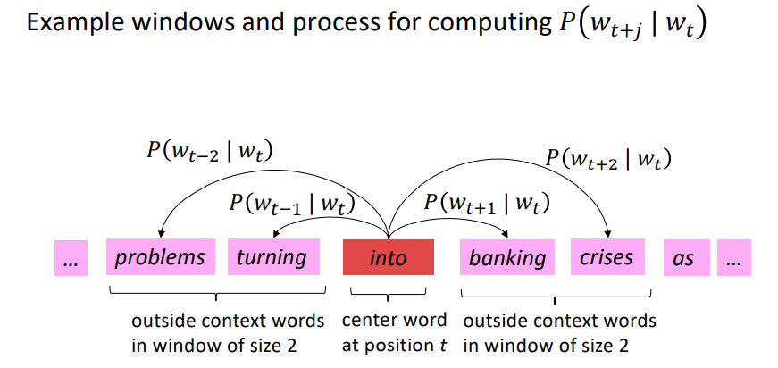
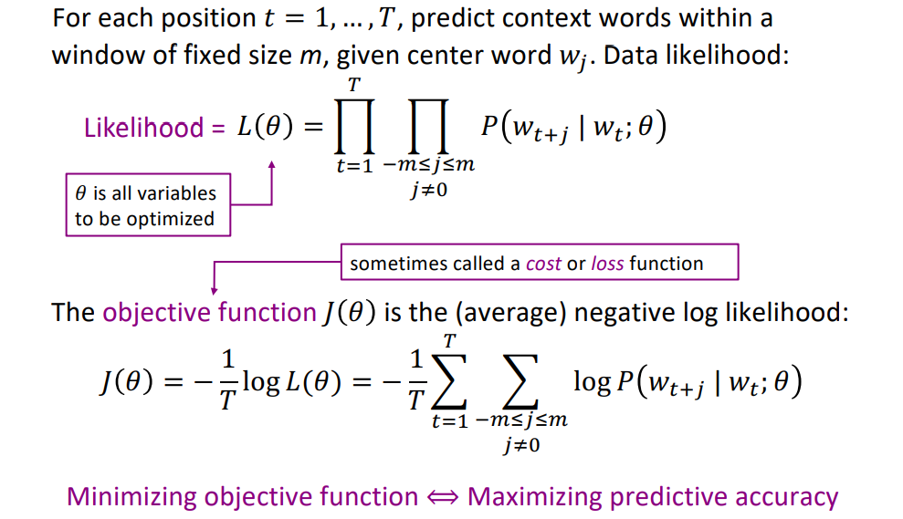
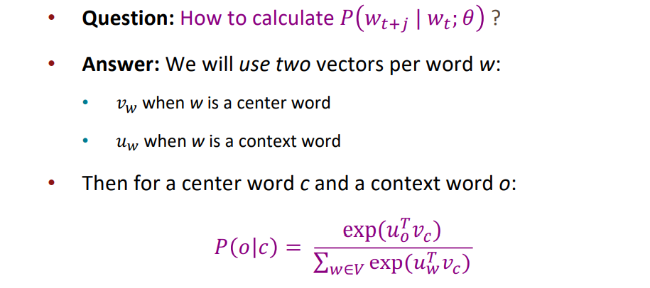
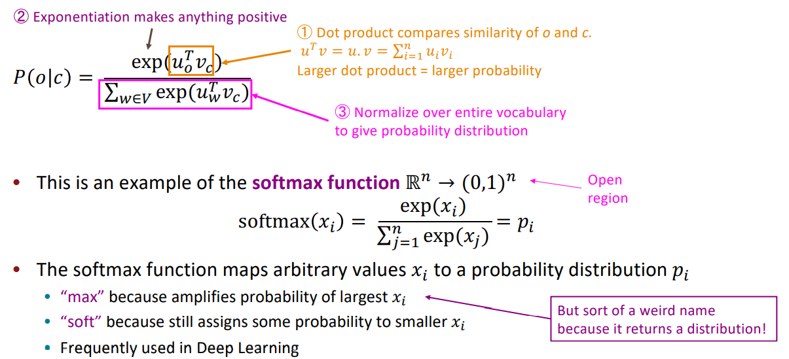
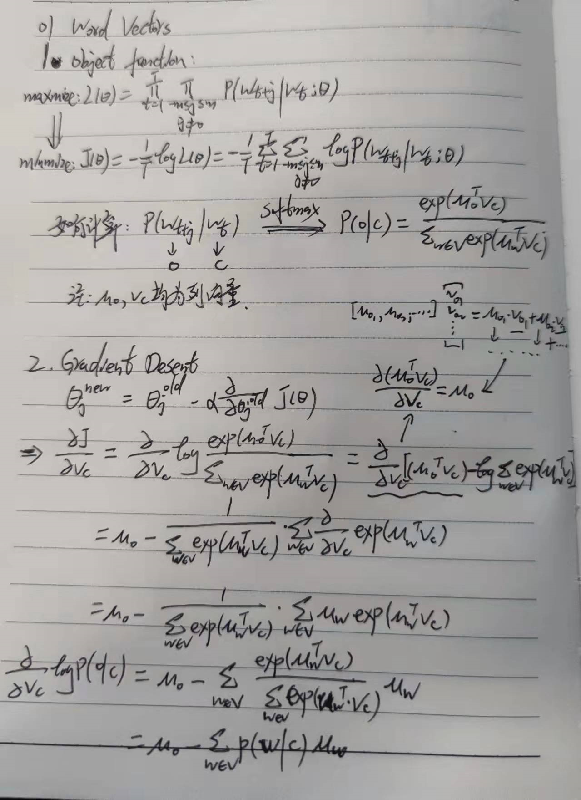

# 01 Word Vectors

## Word2vec: Overview

Word2vec (Mikolov et al. 2013) is a framework for learning word vectors 

Idea: 

-  We have a large corpus (“body”) of text 
-  Every word in a fixed vocabulary is represented by a vector 
-  Go through each position t in the text, which has a center word c and context  (“outside”) words o 
-  Use the similarity of the word vectors for c and o to calculate the probability of o given  c (or vice versa) 
-  Keep adjusting the word vectors to maximize this probability

## Objective function

## Prediction function

##  Word2vec derivations of gradient

- Word2Vec损失函数与梯度下降推导：

## Link

- [Word2Vec Note](https://cs224d.stanford.edu/lecture_notes/notes1.pdf)
- Gensim

