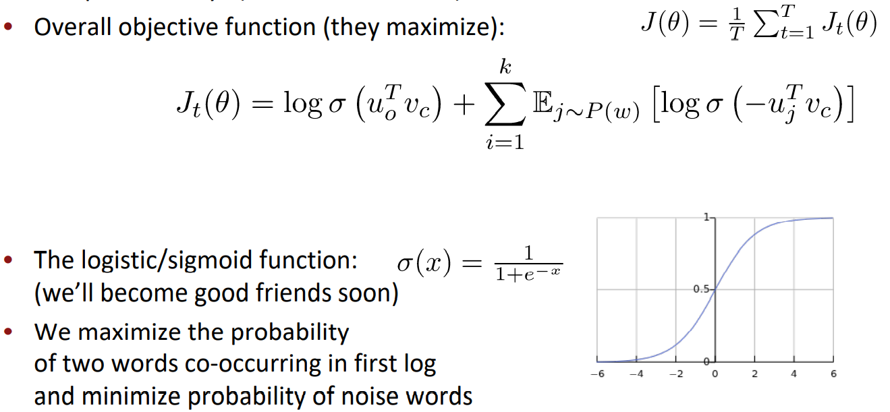
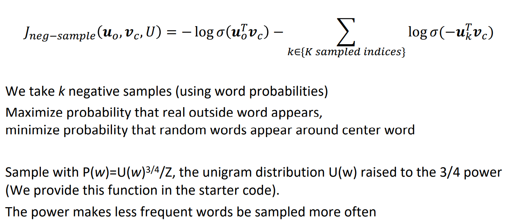
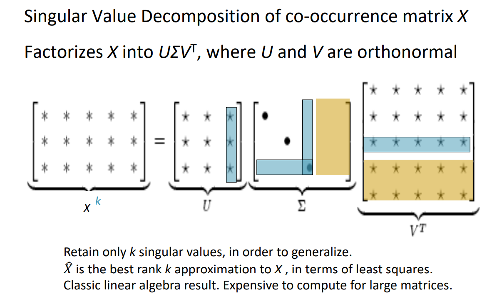
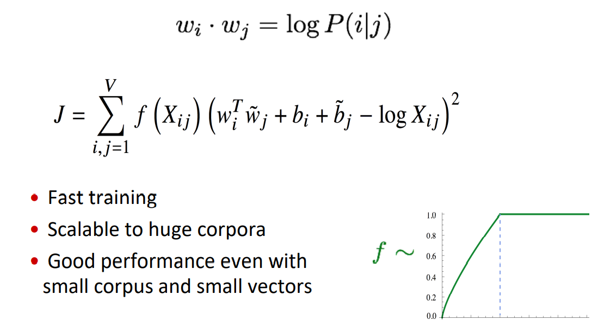

# 02 Word Vectors 2 and Word Window Classification

## Word2vec algorithm family

Why two vectors? 

- Easier optimization. Average both at the end • But can implement the algorithm with just one vector per word … and it helps

Two model variants: 

1. **Skip-grams (SG)**  ：Predict context (“outside”) words (position independent) given center word 
2. **Continuous Bag of Words (CBOW)**  ：Predict center word from (bag of) context words

Additional efficiency in training:  **Negative sampling**

## The skip-gram model with negative sampling

From paper: “Distributed Representations of Words and Phrases and their  Compositionality” (Mikolov et al. 2013)

## Classic Method: Dimensionality Reduction on X

## Combining the best of both worlds 

GloVe [Pennington, Socher, and Manning, EMNLP 2014]

## How to evaluate word vectors?

- Related to general evaluation in NLP: Intrinsic vs. extrinsic 
- Intrinsic: 
  - Evaluation on a specific/intermediate subtask 
  - Fast to compute 
  - Helps to understand that system 
  - Not clear if really helpful unless correlation to real task is established 
- Extrinsic: 
  - Evaluation on a real task
  - Can take a long time to compute accuracy 
  - Unclear if the subsystem is the problem or its interaction or other subsystems 
  - If replacing exactly one subsystem with another improves accuracy -> Winning

## Links

- [详细介绍Word2Vec](https://blog.creativecc.cn/posts/word2vec.html)
- [Note](https://web.stanford.edu/class/cs224n/readings/cs224n-2019-notes02-wordvecs2.pdf)
