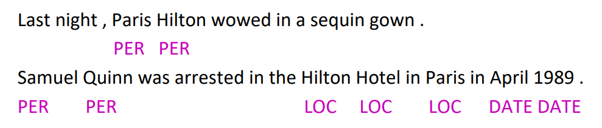
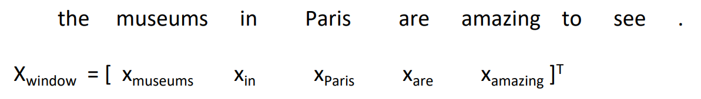
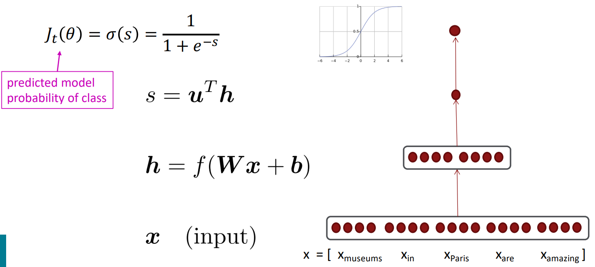
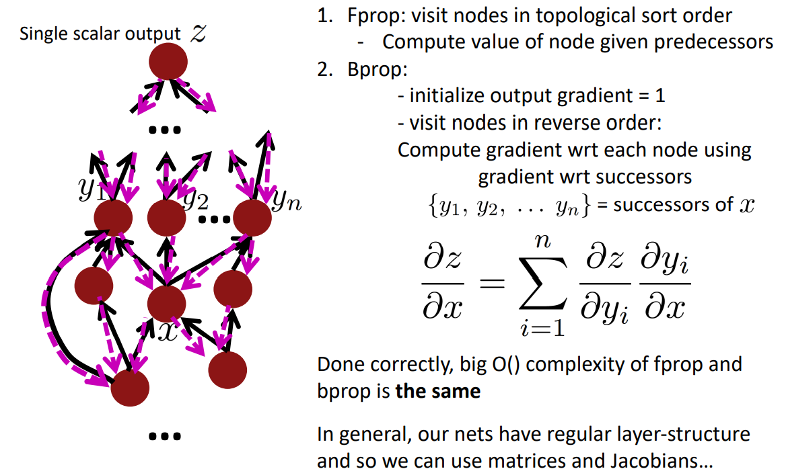

# Backprop and Neural Networks

## Named Entity Recognition (NER)

The task: find and classify names in text, for example:

Possible uses: 

- Tracking mentions of particular entities in documents 
- For question answering, answers are usually named entities 

Often followed by Named Entity Linking/Canonicalization into Knowledge Base

### Simple NER: Window classification using binary logistic classifier

- Idea: classify each word in its context window of neighboring words 
- Train logistic classifier on hand-labeled data to classify center word {yes/no} for each  class based on a concatenation of word vectors in a window 
  - Really, we usually use multi-class softmax, but trying to keep it simple 

- Example: Classify “Paris” as +/– location in context of sentence with window length 2:

- To classify all words: run classifier for each class on the vector centered on each word  in the sentence

We do supervised training and want high score if it’s a location：

## Back-Prop in General Computation Graph

## Summary

- Backpropagation: recursively (and hence efficiently) apply the chain rule  along computation graph 
  - **[downstream gradient] = [upstream gradient] x [local gradient]** 
- Forward pass: compute results of operations and save intermediate values 
- Backward pass: apply chain rule to compute gradients

## Links

- [Note](https://web.stanford.edu/class/cs224n/readings/cs224n-2019-notes03-neuralnets.pdf)
- [matrix calculus notes](https://web.stanford.edu/class/cs224n/readings/gradient-notes.pdf)
- [Review of differential calculus](https://web.stanford.edu/class/cs224n/readings/review-differential-calculus.pdf)
- [CS231n notes on network architectures](http://cs231n.github.io/neural-networks-1/)
- [CS231n notes on backprop](http://cs231n.github.io/optimization-2/)
- [Derivatives, Backpropagation, and Vectorization](http://cs231n.stanford.edu/handouts/derivatives.pdf)
- [Yes you should understand backprop](https://medium.com/@karpathy/yes-you-should-understand-backprop-e2f06eab496b)

