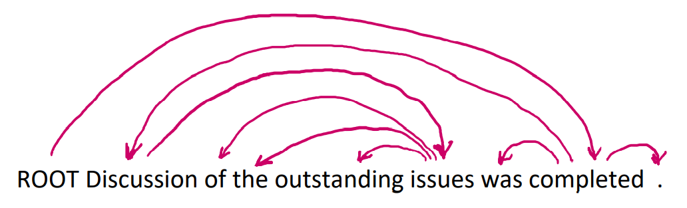
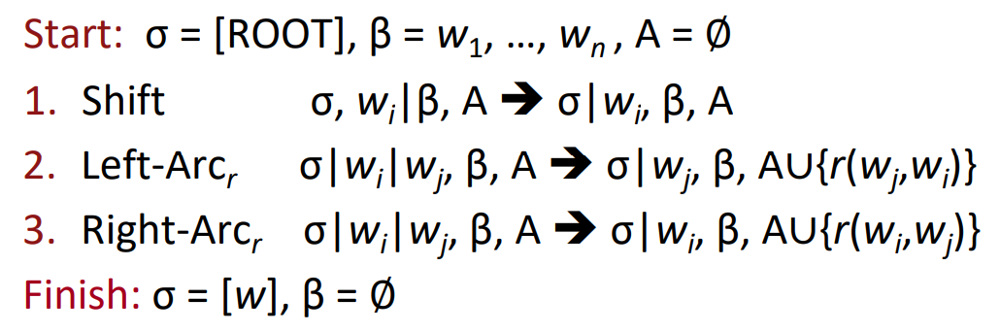

# Dependency Parsing

**Two views of linguistic structure: Constituency = phrase  structure grammar = context-free grammars (CFGs)**

## Dependency Conditioning Preferences

What are the sources of information for dependency parsing? 

1. **Bilexical affinities** 	The dependency [discussion -> issues] is plausible 
2. **Dependency distance** Most dependencies are between nearby words 
3. **Intervening material** Dependencies rarely span intervening verbs or punctuation
4. **Valency of heads** How many dependents on which side are usual for a head?

## Projectivity

- Definition of a projective parse: There are no crossing dependency arcs when the  words are laid out in their linear order, with all arcs above the words 
- Dependencies corresponding to a CFG tree must be projective 
  - I.e., by forming dependencies by taking 1 child of each category as head 
- Most syntactic structure is projective like this, but dependency theory normally does  allow non-projective structures to account for displaced constituents 
  - You can’t easily get the semantics of certain constructions right without these  nonprojective dependencies

## Methods of Dependency Parsing

- Dynamic programming 
  - Eisner (1996) gives a clever algorithm with complexity O(n3), by producing parse items  with heads at the ends rather than in the middle 
- Graph algorithms 
  - You create a Minimum Spanning Tree for a sentence McDonald et al.’s (2005) 
  - MSTParser scores dependencies independently using an ML  
  - classifier (he uses MIRA, for online learning, but it can be something else) 
  - Neural graph-based parser: Dozat and Manning (2017) et seq. – very successful! 
- Constraint Satisfaction  
  - Edges are eliminated that don’t satisfy hard constraints. Karlsson (1990), etc. 
- “Transition-based parsing” or “deterministic dependency parsing” 
  - Greedy choice of attachments guided by good machine learning classifiers
  -  E.g., MaltParser (Nivre et al. 2008). Has proven highly effective.

## Basic transition-based dependency parser

## Links

- [Note](https://web.stanford.edu/class/cs224n/readings/cs224n-2019-notes04-dependencyparsing.pdf)
- [中文笔记](https://zhuanlan.zhihu.com/p/66268929)

