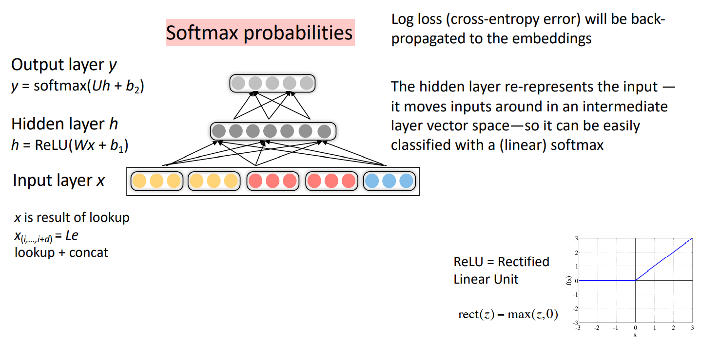
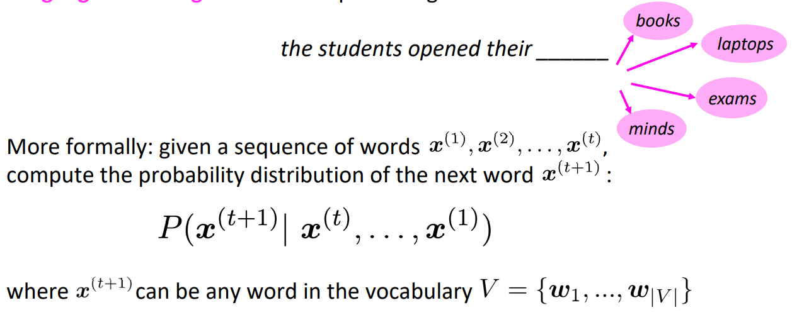
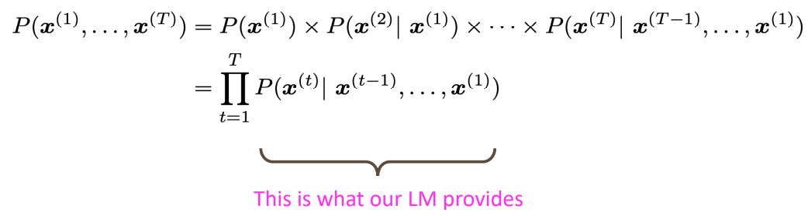
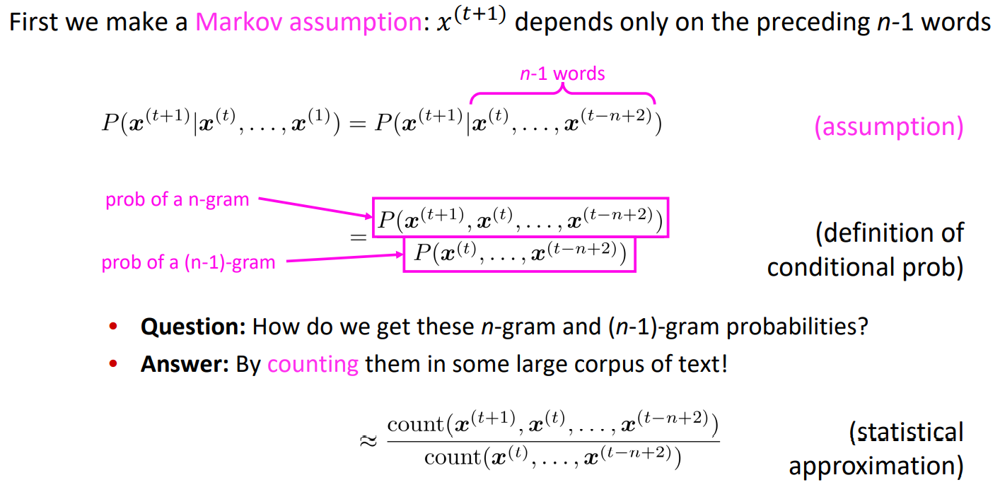
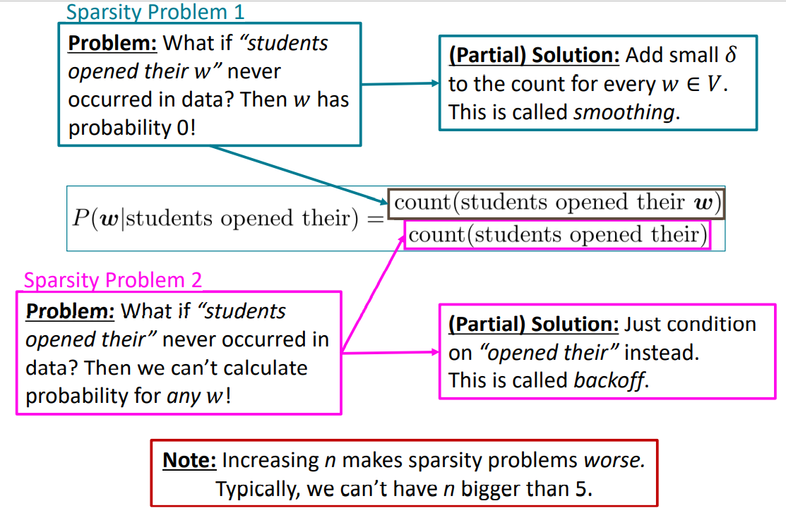
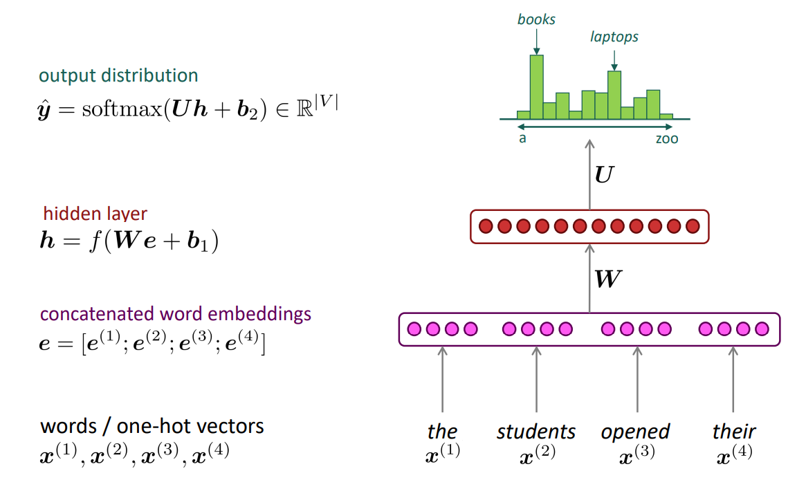
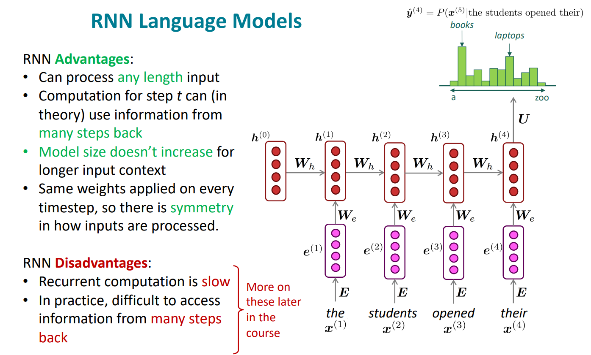

# Recurrent Neural Networks and Language Models

## Simple feed-forward neural network multi-class classifier

## A bit more about neural networks

- Regularization
- Dropout
- Vectorization（Matrices are awesome）
- Non-linearities, activate function
- Parameter Initialization
- Optimizers
- Learning Rates

## Language Modeling + RNNs

### Language Modeling

**Language Modeling** is the task of predicting what word comes next

### n-gram Language Models

Definition: A n-gram is a chunk of n consecutive words.

- unigrams: “the”, “students”, “opened”, ”their” 
- bigrams: “the students”, “students opened”, “opened their” 
- trigrams: “the students opened”, “students opened their” 
- 4-grams: “the students opened their”

**Sparsity Problems with n-gram Language Models**

**A fixed-window neural Language Model**

### Recurrent Neural Networks (RNN)

## Links

- [Note](https://web.stanford.edu/class/cs224n/readings/cs224n-2019-notes05-LM_RNN.pdf)
- [The Unreasonable Effectiveness of Recurrent Neural Networks](http://karpathy.github.io/2015/05/21/rnn-effectiveness/) (blog post overview)
- [On Chomsky and the Two Cultures of Statistical Learning](http://norvig.com/chomsky.html)

