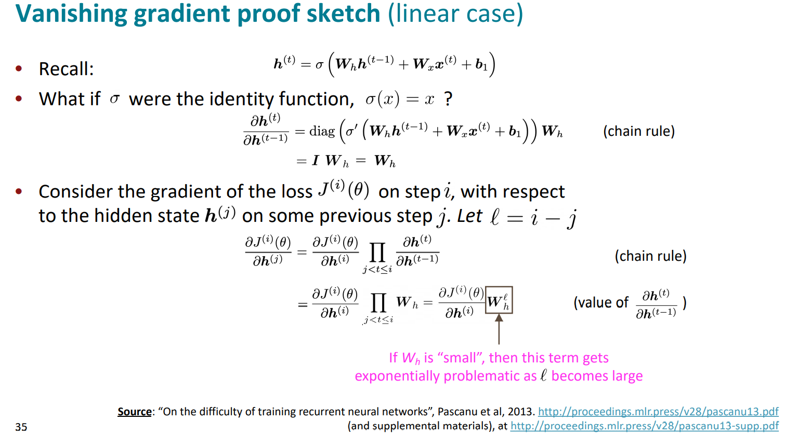

# Vanishing Gradients, Fancy RNNs, Seq2Seq

## The Simple RNN Language Model

### Training an RNN Language Mode

## Evaluating Language Models

- perplexity

## Vanishing gradient intuition

## Gradient clipping: solution for exploding gradient

## Long Short-Term Memory RNNs (LSTMs)

- Hadamard product：矩阵对应位置相乘

## Bidirectional and Multi-layer RNNs: motivation

- Note: bidirectional RNNs are only applicable if you have access to the entire input  sequence 
  - They are not applicable to Language Modeling, because in LM you only have left  context available. 
- If you do have entire input sequence (e.g., any kind of encoding), bidirectionality is  powerful (you should use it by default)

### Multi-layer RNNs

## Links

- [Note](https://web.stanford.edu/class/cs224n/readings/cs224n-2019-notes05-LM_RNN.pdf)
- [Sequence Modeling: Recurrent and Recursive Neural Nets](http://www.deeplearningbook.org/contents/rnn.html) (Sections 10.3, 10.5, 10.7-10.12)
- [Vanishing Gradients Jupyter Notebook](https://web.stanford.edu/class/archive/cs/cs224n/cs224n.1174/lectures/vanishing_grad_example.html) (demo for feedforward networks)
- [Understanding LSTM Networks](http://colah.github.io/posts/2015-08-Understanding-LSTMs/) (blog post overview)

