# Machine Translation, Attention, Subword Models

## Pre-Neural Machine Translation

**Machine Translation (MT)** is the task of translating a sentence x from one language (the  source language) to a sentence y in another language (the target language).

### 1990s-2010s: Statistical Machine Translation

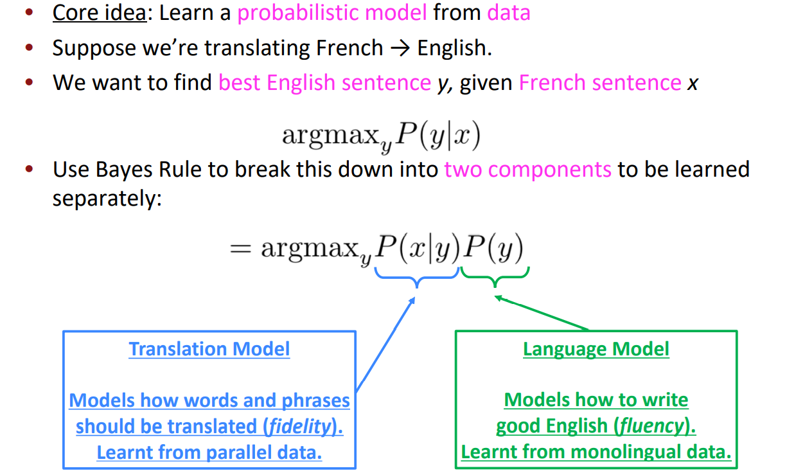

### Learning alignment for SMT

Alignment can be 

- many-to-one
- one-to-many
- many-to-many

### Feature

SMT was a huge research field 

The best systems were extremely complex 

- Hundreds of important details we haven’t mentioned here 
- Systems had many separately-designed subcomponents  
- Lots of feature engineering 
  - Need to design features to capture particular language phenomena 
- Require compiling and maintaining extra resources
  - Like tables of equivalent phrases 
- Lots of human effort to maintain
  - Repeated effort for each language pair!

## Neural Machine Translation

- **Neural Machine Translation (NMT)** is a way to do Machine Translation with a single end-to-end neural network 

- The neural network architecture is called a **sequence-to-sequence model (aka seq2seq)**  and it involves two RNNs

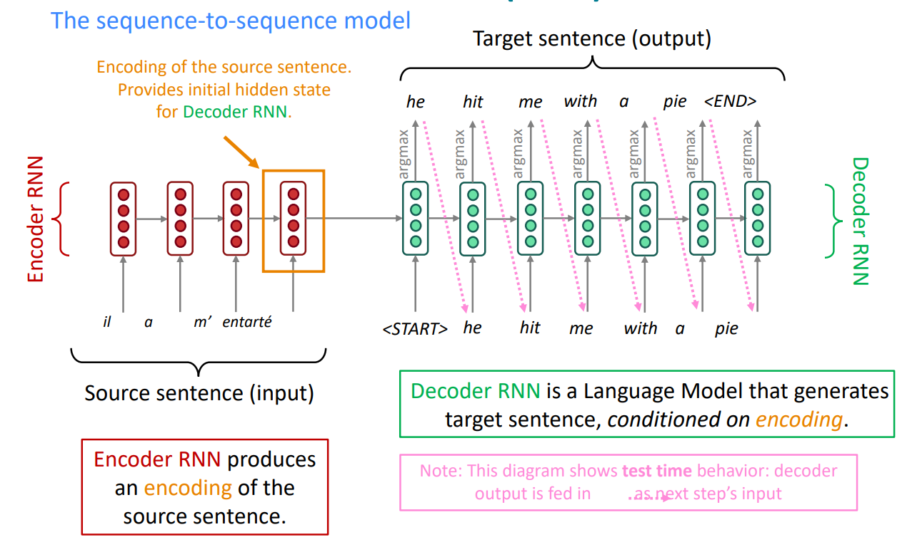

### Sequence-to-sequence is versatile!

- Many NLP tasks can be phrased as sequence-to-sequence: 
  - Summarization (long text → short text) 
  - Dialogue (previous utterances → next utterance) 
  - Parsing (input text → output parse as sequence) 
  - Code generation (natural language → Python code)

### Neural Machine Translation (NMT)

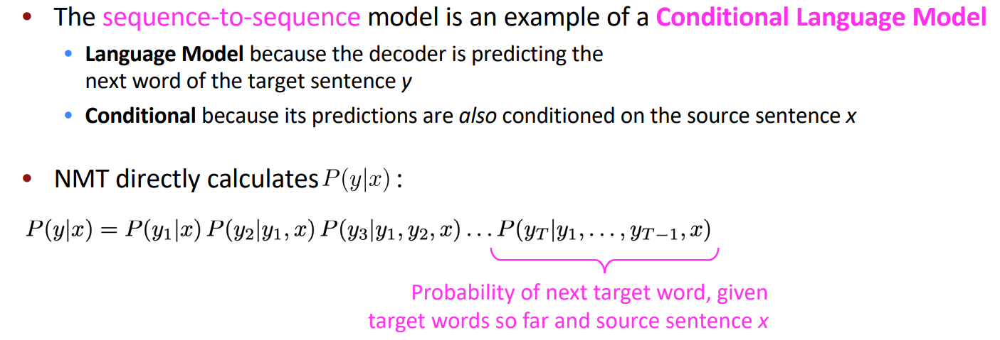

### Training a Neural Machine Translation system

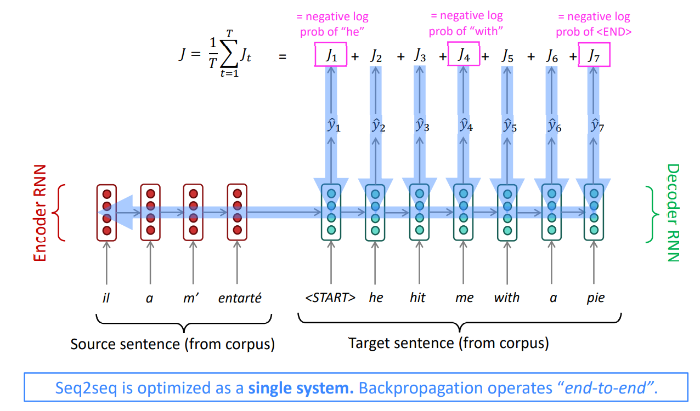

### Multi-layer RNNs in practice

- High-performing RNNs are usually multi-layer (but aren’t as deep as convolutional or  feed-forward networks)
-  For example: In a 2017 paper, Britz et al. find that for Neural Machine Translation, 2 to  4 layers is best for the encoder RNN, and 4 layers is best for the decoder RNN 
  - Often 2 layers is a lot better than 1, and 3 might be a little better than 2 
  - Usually, skip-connections/dense-connections are needed to train deeper RNNs (e.g., 8 layers) 
- Transformer-based networks (e.g., BERT) are usually deeper, like 12 or 24 layers. • You will learn about Transformers later; they have a lot of skipping-like connection

### Beam search decoding

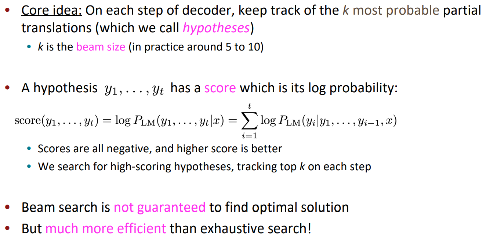

**Example：**

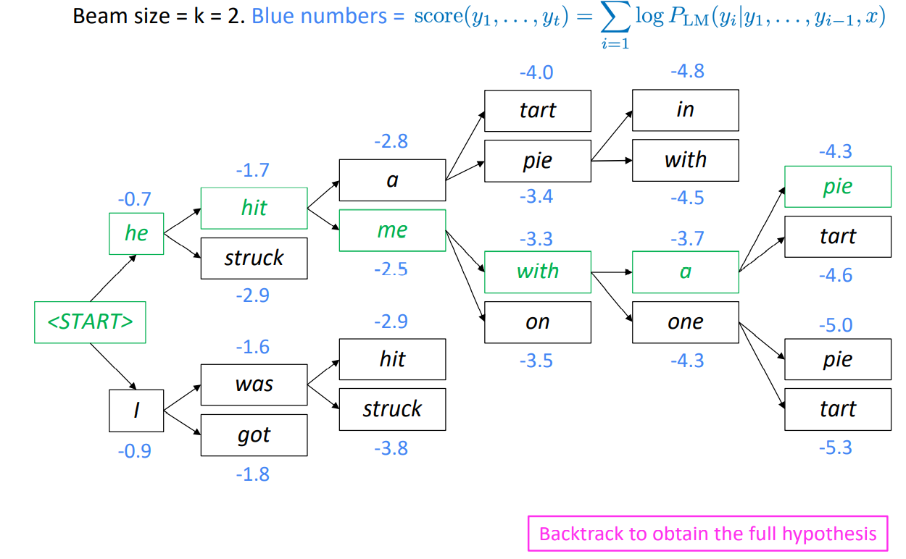

**stopping criterion**

- In greedy decoding, usually we decode until the model produces an  token 
  - For example:  he hit me with a pie 
- In beam search decoding, different hypotheses may produce  tokens on  different timesteps 
  - When a hypothesis produces , that hypothesis is complete.
  - Place it aside and continue exploring other hypotheses via beam search. 
- Usually we continue beam search until:
  - We reach timestep T (where T is some pre-defined cutoff), or 
  - We have at least n completed hypotheses (where n is pre-defined cutoff)

**finishing up**

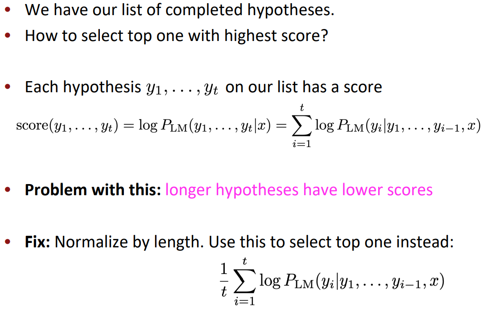

### Advantages of NMT

Compared to SMT, NMT has many advantages: 

- Better performance
  - More fluent 
  - Better use of context 
  - Better use of phrase similarities 
- A single neural network to be optimized end-to-end 
  - No subcomponents to be individually optimized 
- Requires much less human engineering effort 
  - No feature engineering 
  - Same method for all language pairs

### Disadvantages of NMT?

- NMT is less interpretable  
  - Hard to debug 
- NMT is difficult to control 
  - For example, can’t easily specify rules or guidelines for translation 
  - Safety concerns!

### How do we evaluate Machine Translation?

**BLEU (Bilingual Evaluation Understudy)**

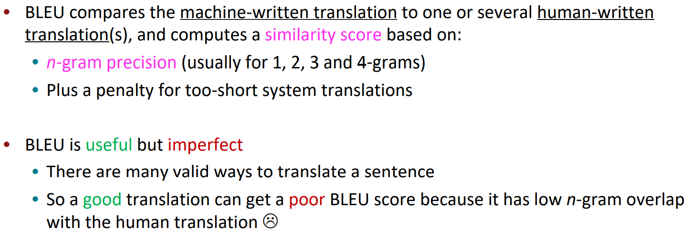

Many difficulties remain: 

- Out-of-vocabulary words 
- Domain mismatch between train and test data 
- Maintaining context over longer text 
- Low-resource language pairs 
- Failures to accurately capture sentence meaning 
- Pronoun (or zero pronoun) resolution errors 
- Morphological agreement errors

## Attention

### Sequence-to-sequence: the bottleneck problem

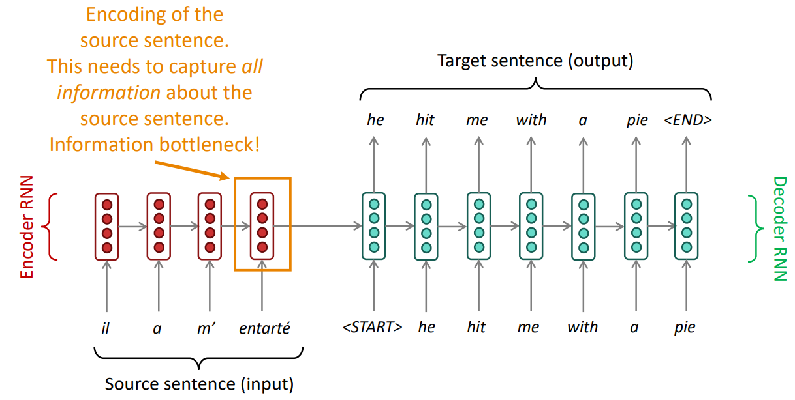

Attention provides a solution to the bottleneck problem. 

Core idea: on each step of the decoder, use direct connection to the encoder to focus  on a particular part of the source sequence

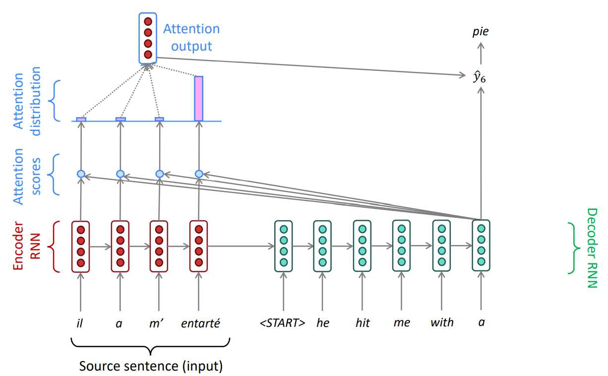

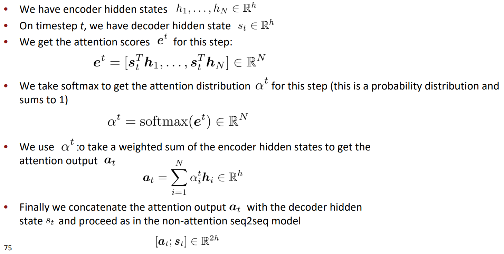

### Attention is great

- Attention significantly improves NMT performance 
  - It’s very useful to allow decoder to focus on certain parts of the source 
- Attention solves the bottleneck problem 
  - Attention allows decoder to look directly at source; bypass bottleneck 
- Attention helps with vanishing gradient problem 
  - Provides shortcut to faraway states 
- Attention provides some interpretability 
  - By inspecting attention distribution, we can see  what the decoder was focusing on
  - We get (soft) alignment for free!
  - This is cool because we never explicitly trained an alignment system
  - The network just learned alignment by itself

### Attention variants

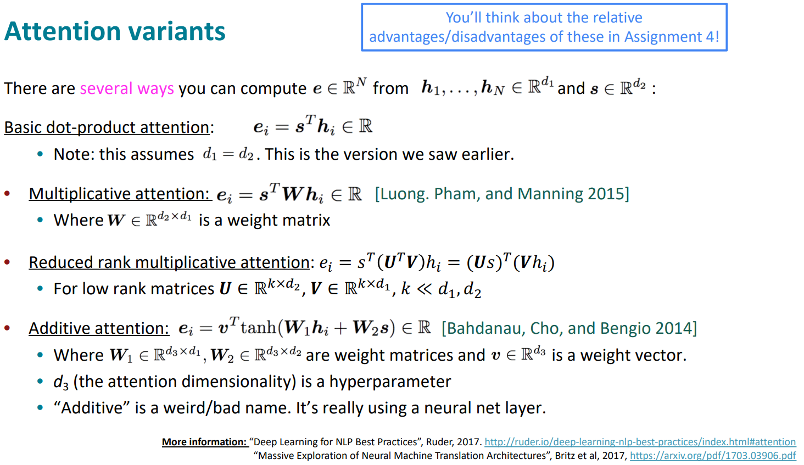

### Attention is a general Deep Learning technique

- More general definition of attention: Given a set of vector values, and a vector query, attention is a technique to compute  a weighted sum of the values, dependent on the query.

Intuition: 

- The weighted sum is a selective summary of the information contained in the values,  where the query determines which values to focus on. 
- Attention is a way to obtain a fixed-size representation of an arbitrary set of  representations (the values), dependent on some other representation (the query).

## Links

- [Note](https://web.stanford.edu/class/cs224n/readings/cs224n-2019-notes06-NMT_seq2seq_attention.pdf)
- [Statistical Machine Translation slides, CS224n 2015](https://web.stanford.edu/class/archive/cs/cs224n/cs224n.1162/syllabus.shtml) (lectures 2/3/4)
- [Attention and Augmented Recurrent Neural Networks](https://distill.pub/2016/augmented-rnns/) (blog post overview)
- [Statistical Machine Translation](https://www.cambridge.org/core/books/statistical-machine-translation/94EADF9F680558E13BE759997553CDE5) (book by Philipp Koehn)

