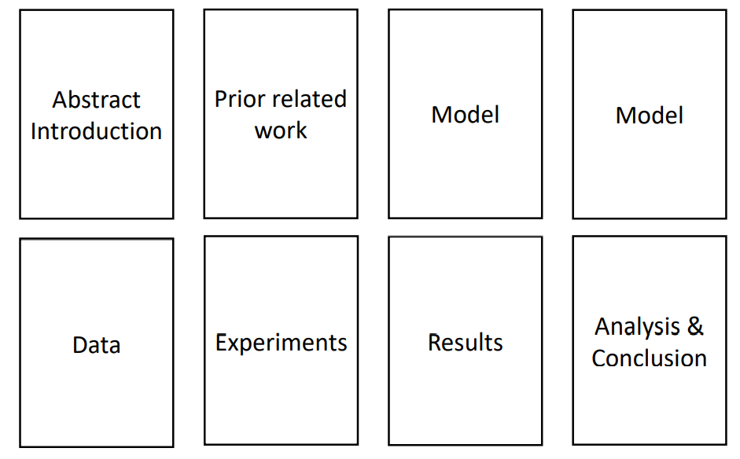
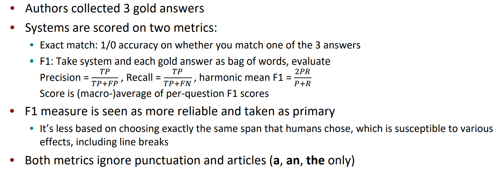

# Final Projects: Custom and Default; Practical Tips

## The Final Project

- Do the default project, which is SQuAD question answering (2 sub-variants) 
  - Open-ended but an easier start; a good choice for most 
- Propose a custom final project, which we must approve 
  - You will receive feedback from a mentor (TA/prof/postdoc/PhD)

### The Default Final Project

Two variant question answering (QA) tasks 

1. Building a textual question answering architecture for SQuAD from scratch
   -  Stanford Question Answering Dataset: https://rajpurkar.github.io/SQuAD-explorer/ 
   - Providing starter code in PyTorch. J Attempting SQuAD 2.0 (has unanswerable Qs) 
2. Building a Robust QA system which works on different QA datasets/domains 
   - You train on SQuAD, NewsQA and Natural Questions; test sets are DuoRC, Race and ZSRE by RC 
   - Starting point is large pre-trained LM (DistilBERT); you work mainly on robustness methods

### Project Proposal

1. Find a relevant (key) research paper for your topic 
   - For DFP, we provide some suggestions, but you might look elsewhere for interesting QA/reading  comprehension work 
2. Write a summary of that research paper and what you took away from it as key ideas  that you hope to use
3. Write what you plan to work on and how you can innovate in your final project work 
   - Suggest a good milestone to have achieved as a halfway point 
4. Describe as needed, especially for Custom projects: 
   - A project plan, relevant existing literature, the kind(s) of models you will use/explore; the data you  will use (and how it is obtained), and how you will evaluate success

### Project writeup

## Finding Research Topics

两个基本的出发点，对于所有的科学来说。
- 钉子：从一个感兴趣的（领域）问题开始，试图找到比目前已知/使用的好的/更好的方法来解决它。解决这个问题的好的/更好的方法，而不是目前已知/使用的方法
- 锤子：从一个感兴趣的技术方法/途径开始，并找出好的 拓展或改进它的好方法，或应用它的新方法。

### Project types

1. 找到一个感兴趣的应用/任务，探索如何有效地接近/解决它。通常使用一个现有的模型
   - 可以是野外的任务或一些现有的Kaggle/bake-off/共享任务 
2. 实现一个复杂的神经结构，并在一些数据上展示其性能。
3. 想出一个新的或变异的神经网络模型，并探索其经验性的成功。
4. 分析项目，分析一个模型的行为：它如何代表语言学知识，或它能处理什么样的现象，或它所犯的错误。
5. 罕见的理论项目，展示一个模型的一些有趣的、非琐碎的属性类型、数据或数据表示法的一些有趣的、非简单的属性

## How to find an interesting place to start?

- Look at ACL anthology for NLP papers: https://www.aclweb.org/anthology/ 
- Also look at the online proceedings of major ML conferences:  NeurIPS https://papers.nips.cc, ICML, ICLR

- Look at online preprint servers, especially: https://arxiv.org

- Hal Varian: How to Build an Economic Model in Your Spare Time  https://people.ischool.berkeley.edu/~hal/Papers/how.pdf

- [Arxiv Sanity Preserver (arxiv-sanity.com)](http://www.arxiv-sanity.com/)

### Want to beat the state  of the art on something?

- [Browse the State-of-the-Art in Machine Learning | Papers With Code](https://paperswithcode.com/sota)
- [nlpprogress.com](https://nlpprogress.com/)
- [GLUE Benchmark](https://gluebenchmark.com/leaderboard/)
- [Previous shared tasks | CoNLL](https://www.conll.org/previous-tasks/)

### Finding a topic

Turing award winner and Stanford CS emeritus professor Ed Feigenbaum says to follow  the advice of his advisor, AI pioneer, and Turing and Nobel prize winner Herb Simon: 

-  “If you see a research area where many people are working, go somewhere else.” 

But where to go? Wayne Gretzky: 

-  “I skate to where the puck is going, not where it has been.” 

### Old Deep Learning (NLP), new Deep Learning NLP

- In the early days of the Deep Learning revival (2010-2018), most of the work was in  defining and exploring better deep learning architectures 
- Typical paper: 
  - I can improve a summarization system by not only using attention standardly, but  allowing copying attention – where you use additional attention calculations and an  additional probabilistic gate to simply copy a word from the input to the output 
- That’s what a lot of good CS 224N projects did too
- In 2019–2021, that approach is dead
  - Well, that’s too strong, but it’s difficult and much rarer
- By and large, most work downloads a big pre-trained model and works from there 
  - Action is in fine-tuning, or domain adaptation followed by fine-tuning, etc., etc.

### Exciting areas 2021

- A lot of what is exciting now is problems that work within or around this world 
- Evaluating and improving models for something other than accuracy 
  - Robustness to domain shift 
  - Evaluating the robustness of models in general (someone could hack on this new  project as their final project!): https://robustnessgym.com 
- Doing empirical work looking at what large pre-trained models have learned 
- Working out how to get knowledge and good task performance from large models for  particular tasks without much data (transfer learning, etc.) 
- Looking at the bias, trustworthiness, and explainability of large models 
- Working on how to augment the data for models to improve performance 
- Low resource languages 
- Improving performance on the tail of rare stuff
- Scaling models up and down 
  - Building big models is BIG: GPT-2 and GPT-3 … but just not possible for a cs224n  project 
  - Building small, performant models is also BIG. This could be a great project 
    - Model pruning, e.g.:  https://papers.nips.cc/paper/2020/file/eae15aabaa768ae4a5993a8a4f4fa6e4-Paper.pdf 
    - Model quantization, e.g.: https://arxiv.org/pdf/2004.07320.pdf 
    - How well can you do QA in 6GB or 500MB? https://efficientqa.github.io 
- Looking to achieve more advanced functionalities 
  - E.g., compositionality, systematic generalization, fast learning (e.g., meta-learning)  on smaller problems and amounts of data, and more quickly 
    - BabyAI: https://arxiv.org/abs/2007.12770 
    - gSCAN: https://arxiv.org/abs/2003.05161

## Finding data

### Linguistic Data Consortium

- [Linguistic Data Consortium - Linguistic Data Consortium (upenn.edu)](https://catalog.ldc.upenn.edu/)
- [Resources for Corpora | Linguistics (stanford.edu)](https://linguistics.stanford.edu/resources/resources-corpora)

### Machine translation

- [Statistical Machine Translation (statmt.org)](https://statmt.org/)

### Dependency parsing: Universal Dependencies

- [Universal Dependencies](https://universaldependencies.org/)

### Others

- [Machine Learning Datasets | Papers With Code](https://paperswithcode.com/datasets)
- Look at Kaggle 
- Look at research papers to see what data they use
-  Look at lists of datasets 
  - https://machinelearningmastery.com/datasets-natural-language-processing/ 
  - https://github.com/niderhoff/nlp-datasets 
- Lots of particular things: 
  - https://gluebenchmark.com/tasks 
  - https://nlp.stanford.edu/sentiment/ 
  - https://research.fb.com/downloads/babi/ (Facebook bAbI-related)

## Training a (gated) RNN

1. Use an LSTM (or GRU): it makes your life so much simpler!
2. Initialize recurrent matrices to be orthogonal 
3. Initialize other matrices with a sensible (small!) scale 
4. Initialize forget gate bias to 1: default to remembering 
5. Use adaptive learning rate algorithms: Adam, AdaDelta, … 
6. Clip the norm of the gradient: 1–5 seems to be a reasonable threshold when used  together with Adam or AdaDelta. 
7. Either only dropout vertically or look into using Bayesian Dropout (Gal and Gahramani – not natively in PyTorch) 
8. Be patient! Optimization takes time

### Experimental strategy

- Work incrementally! 
- Start with a very simple model and get it to work! 
  - It’s hard to fix a complex but broken model 
- Add bells and whistles one-by-one and get the model working with each of them (or  abandon them) 
  - Initially run on a tiny amount of data 
  - You will see bugs much more easily on a tiny dataset 
  - Something like 4–8 examples is good 
  - Often synthetic data is useful for this 
  - Make sure you can get 100% on this data 
    - Otherwise your model is definitely either not powerful enough or it is broken

- Train and run your model on a large dataset 
  - It should still score close to 100% on the training data after optimization 
  - Otherwise, you probably want to consider a more powerful model! 
  - Overfitting to training data is not something to be scared of when doing deep learning  
    - These models are usually good at generalizing because of the way distributed representations share  statistical strength regardless of overfitting to training data 
- But, still, you now want good generalization performance: 
  - Regularize your model until it doesn’t overfit on dev data 
    - Strategies like L2 regularization can be useful 
    - But normally generous dropout is the secret to succes

### Details matter

- Look at your data, collect summary statistics 
- Look at your model’s outputs, do error analysis 
- Tuning hyperparameters is often important to the successes of NNets

## Stanford Question Answering Dataset (SQuAD)

### SQuAD evaluation, v1.1

### SQuAD 2.0 Example

Adds unanswerable question

## Links

- [Note](https://web.stanford.edu/class/cs224n/readings/final-project-practical-tips.pdf)
- [How to Build an Economic Model in Your Spare Time](https://people.ischool.berkeley.edu/~hal/Papers/how.pdf)

