# Transformers

## From recurrence (RNN) to attention-based NLP models

### Issues with recurrent models

**Linear interaction distance**

- O(sequence length) steps for distant word pairs to interact means: 
  - Hard to learn long-distance dependencies (because gradient problems!) 
  - Linear order of words is “baked in”; we already know linear order isn’t the  right way to think about sentences…

**Lack of parallelizability**

- Forward and backward passes have O(sequence length)  unparallelizable operations
  - GPUs can perform a bunch of independent computations at once! 
  - But future RNN hidden states can’t be computed in full before past RNN  hidden states have been computed
  - Inhibits training on very large datasets!

**How about word windows?**

- Word window models aggregate local contexts 
  - (Also known as 1D convolution; we’ll go over this in depth later!) 
  - Number of unparallelizable operations does not increase sequence length!

- Word window models aggregate local contexts
- What about long-distance dependencies?
  - Stacking word window layers allows interaction between farther words
- Maximum Interaction distance = sequence length / window size
  - (But if your sequences are too long, you’ll just ignore long-distance context)x

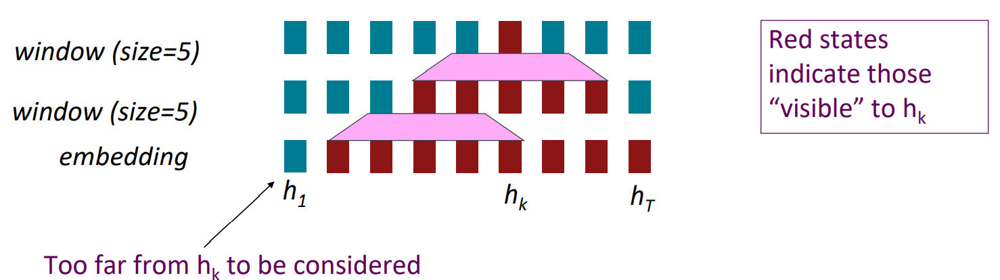

**How about attention?**

- Attention treats each word’s representation as a query to access and  incorporate information from a set of values. 
  - We saw attention from the decoder to the encoder; today we’ll think about  attention within a single sentence.
- Number of unparallelizable operations does not increase sequence length. 
- Maximum interaction distance: O(1), since all words interact at every layer!

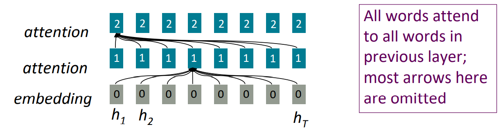

### Self-Attention

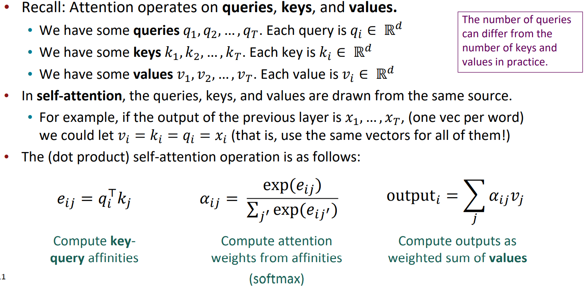

#### sequence order

- **Sinusoidal position representations**: concatenate sinusoidal functions of varying periods:

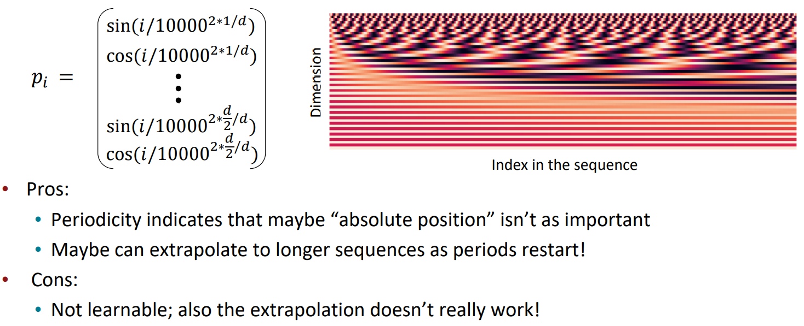

#### Adding nonlinearities

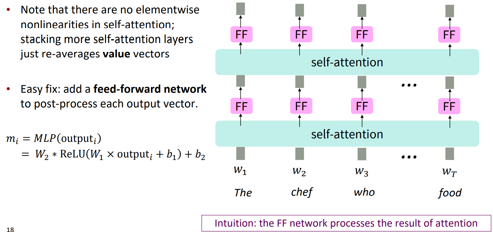

#### Masking the future

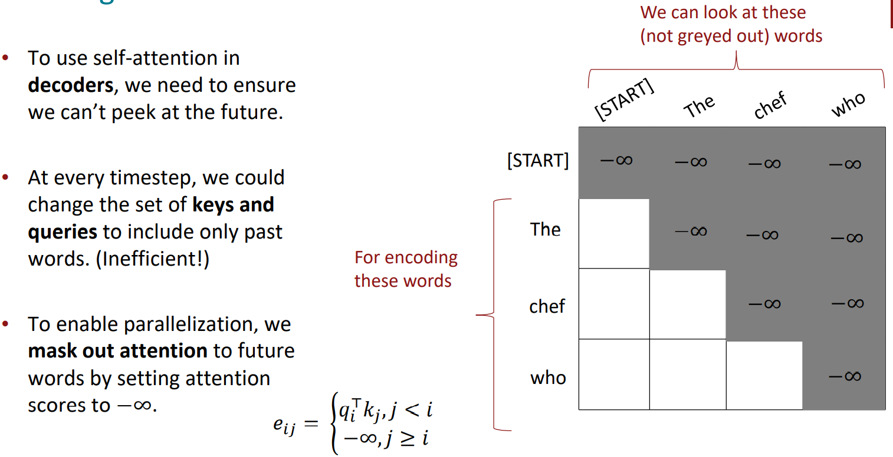

### Barriers and solutions for Self-Attention as a building block

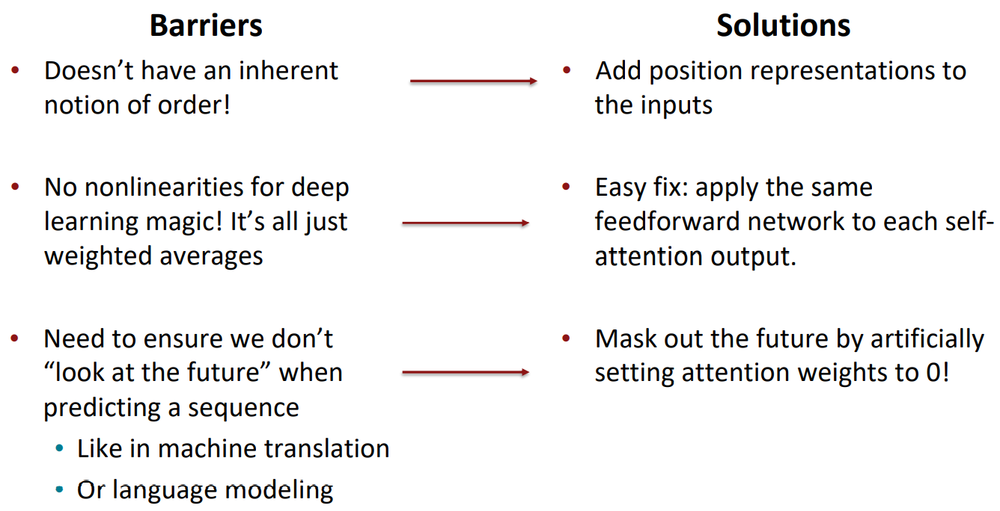

### Necessities for a self-attention building block

- Self-attention: 
  - the basis of the method. 
- Position representations:
  - Specify the sequence order, since self-attention is an unordered function of its  inputs. 
- Nonlinearities: 
  - At the output of the self-attention block
  - Frequently implemented as a simple feed-forward network. 
- Masking: 
  - In order to parallelize operations while not looking at the future. 
  - Keeps information about the future from “leaking” to the past.

## Introducing the Transformer model 

### The Transformer Encoder-Decoder [Vaswani et al., 2017]

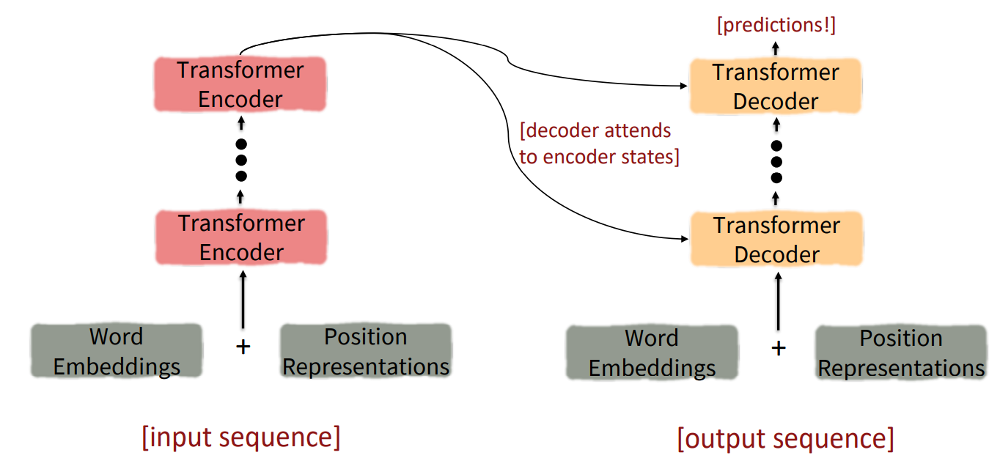

What’s left in a Transformer Encoder Block that we haven’t covered? 

1. **Key-query-value attention**: How do we get the 𝑘, 𝑞, 𝑣 vectors from a single word embedding?
2. **Multi-headed attention**: Attend to multiple places in a single layer! 
3. **Tricks to help with training**! 
   1. Residual connections 
   2. Layer normalization 
   3. Scaling the dot product 
   4. These tricks don’t improve what the model is able to do; they help improve the training process.  Both of these types of modeling improvements are very important!

### Key-Query-Value Attention

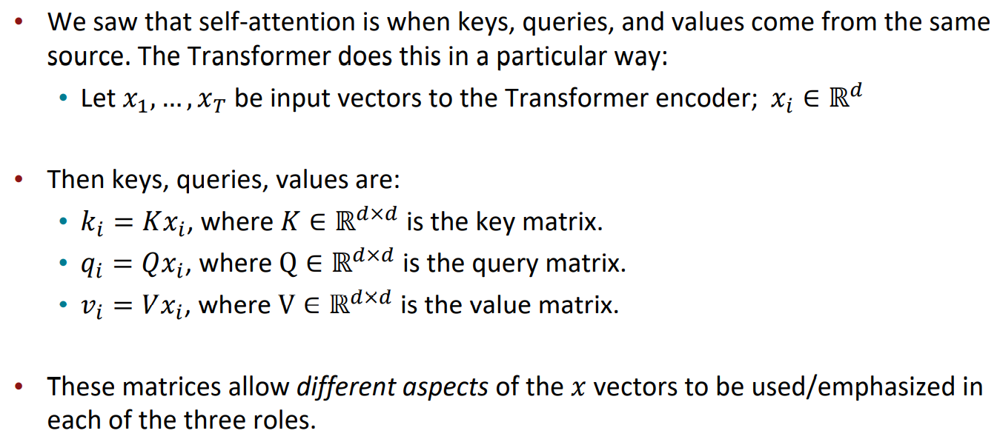

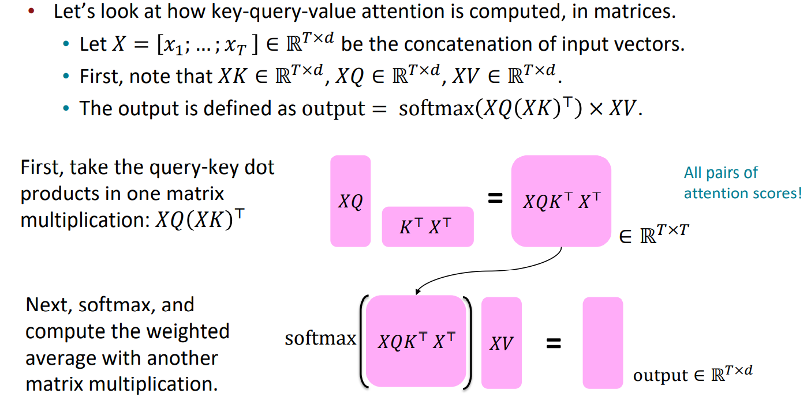

### Multi-headed attention

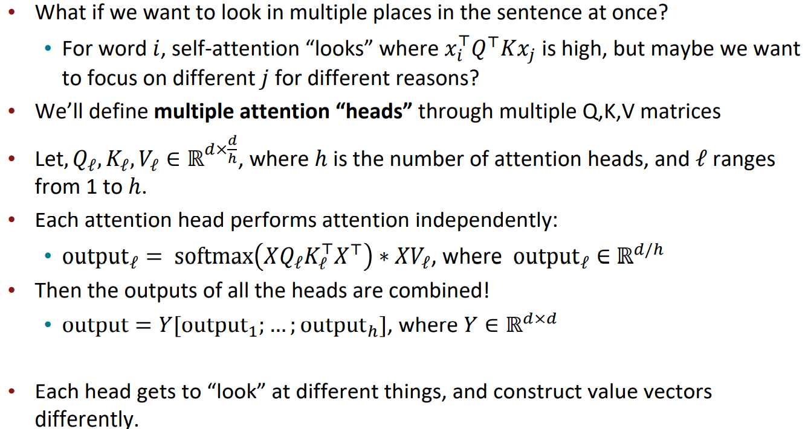

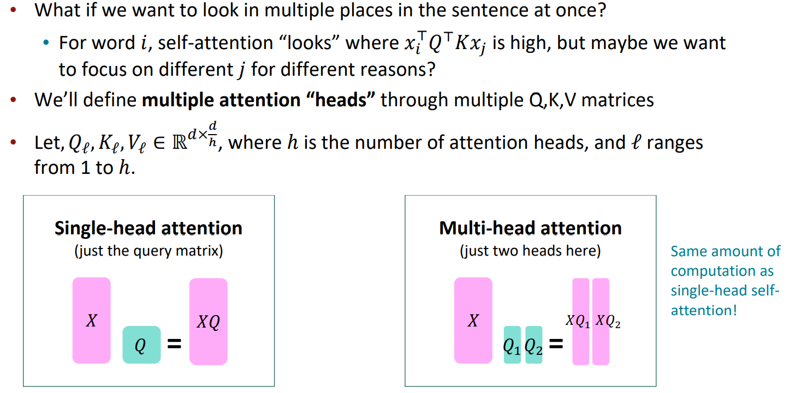

### Residual connections

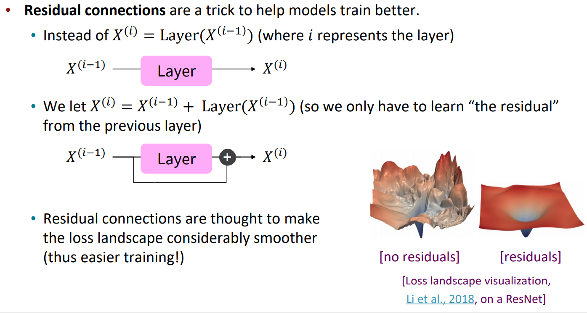

### Layer normalization

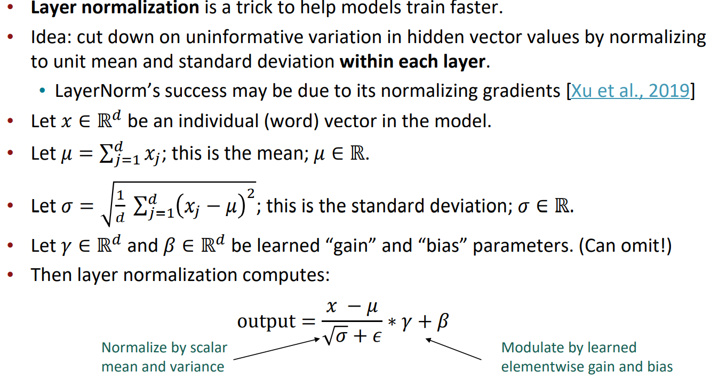

### Scaled Dot Product

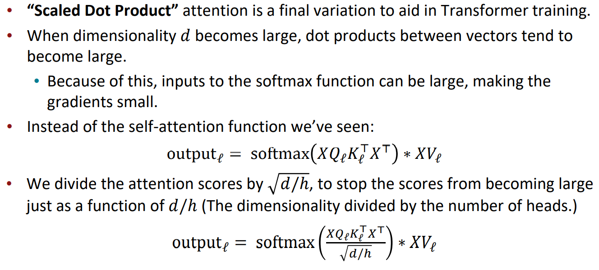

### The Transformer Encoder-Decoder

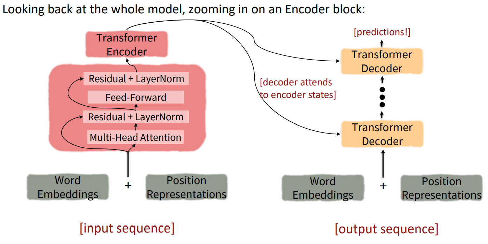

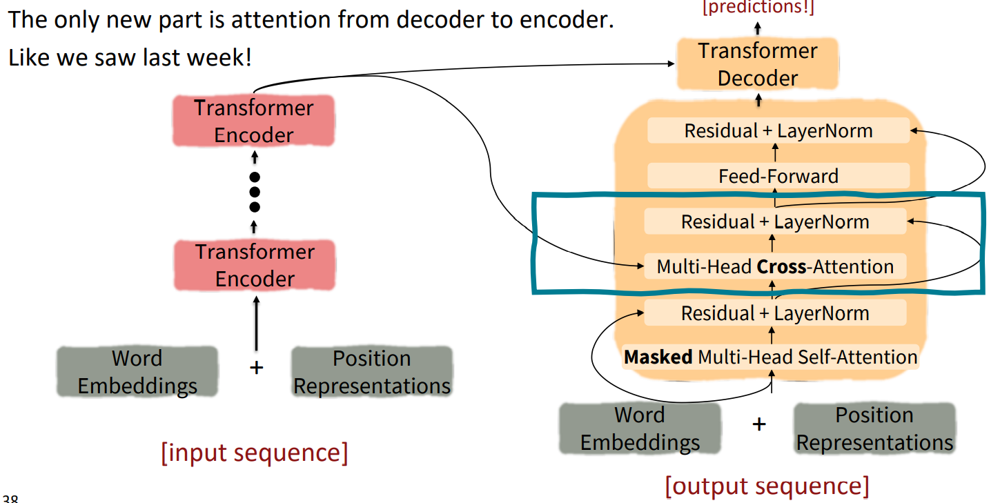

### Cross-attention

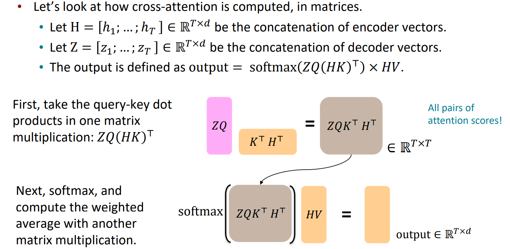

## Drawbacks and variants of Transformers

### Quadratic computation as a function of sequence length

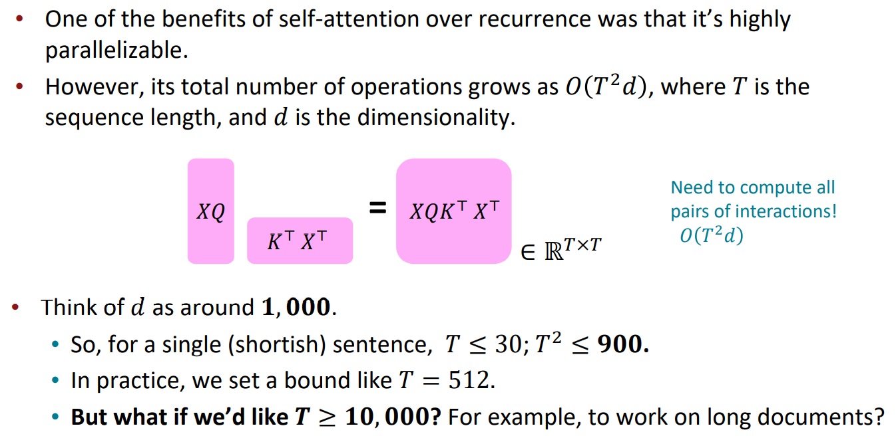

### Recent work on improving on quadratic self-attention cost

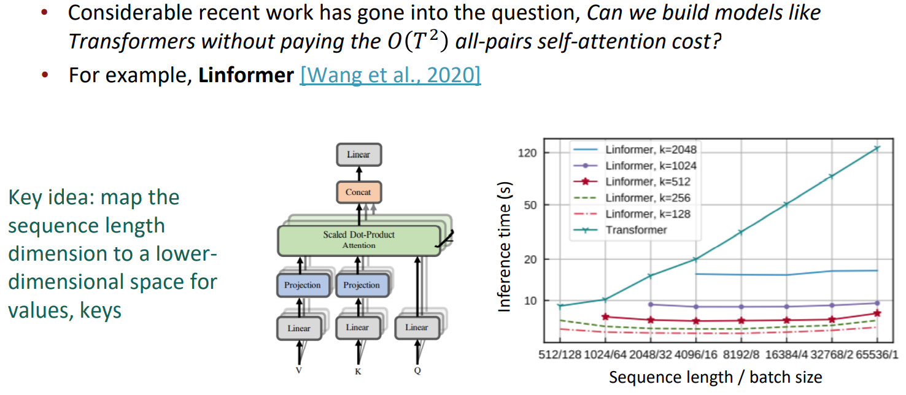

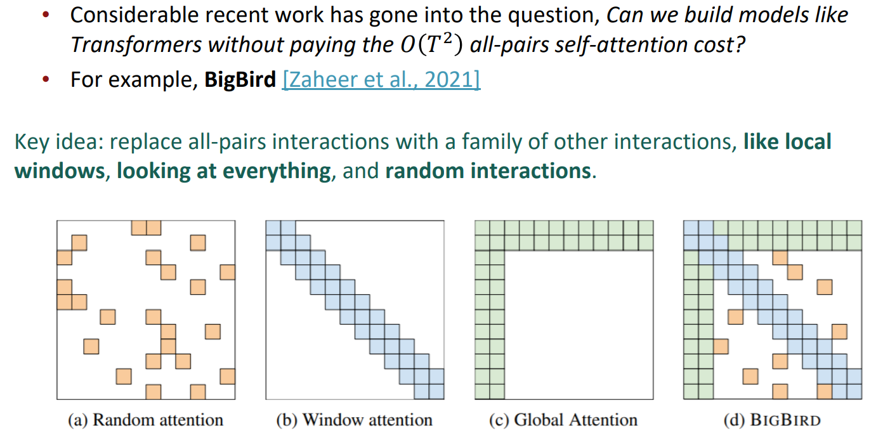

## Links

- [Note](https://web.stanford.edu/class/cs224n/readings/cs224n-2019-notes07-QA.pdf)
- [The Illustrated Transformer](https://jalammar.github.io/illustrated-transformer/)
- [Transformer (Google AI blog post)](https://ai.googleblog.com/2017/08/transformer-novel-neural-network.html)

