# More about Transformers and Pretraining

## A brief note on subword modeling 

### Word structure and subword models

Let’s take a look at the assumptions we’ve made about a language’s vocabulary. 

We assume a fixed vocab of tens of thousands of words, built from the training set. 

All novel words seen at test time are mapped to a single UNK.

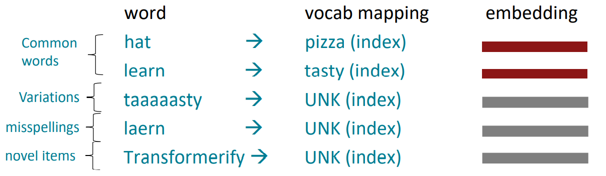

### The byte-pair encoding algorithm

Subword modeling in NLP encompasses a wide range of methods for reasoning about  structure below the word level. (Parts of words, characters, bytes.) 

- The dominant modern paradigm is to learn a vocabulary of parts of words (subword tokens). 
- At training and testing time, each word is split into a sequence of known subwords. 

Byte-pair encoding is a simple, effective strategy for defining a subword vocabulary. 

1. Start with a vocabulary containing only characters and an “end-of-word” symbol. 
2. Using a corpus of text, find the most common adjacent characters “a,b”; add “ab” as a subword. 
3. Replace instances of the character pair with the new subword; repeat until desired vocab size. 

Originally used in NLP for machine translation; now a similar method (WordPiece) is used in pretrained  models.

## Motivating model pretraining from word embeddings 

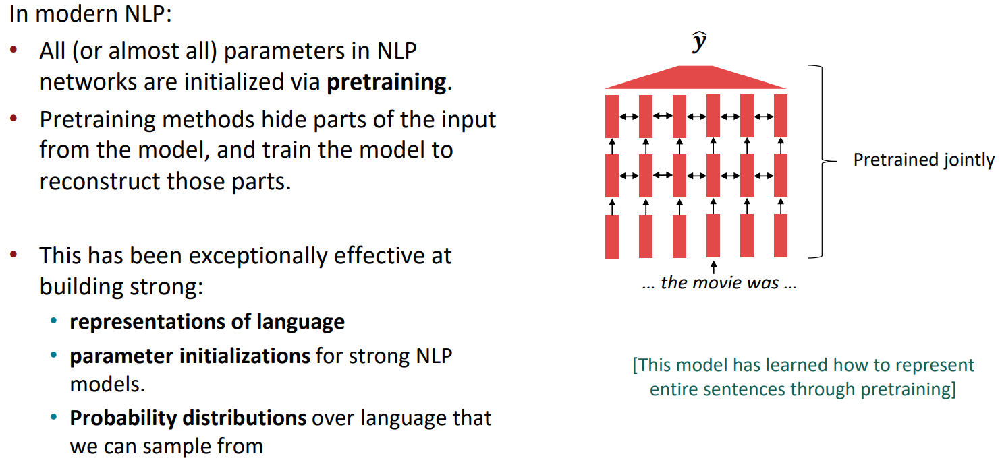

### The Pretraining / Finetuning Paradigm

Pretraining can improve NLP applications by serving as parameter initialization.

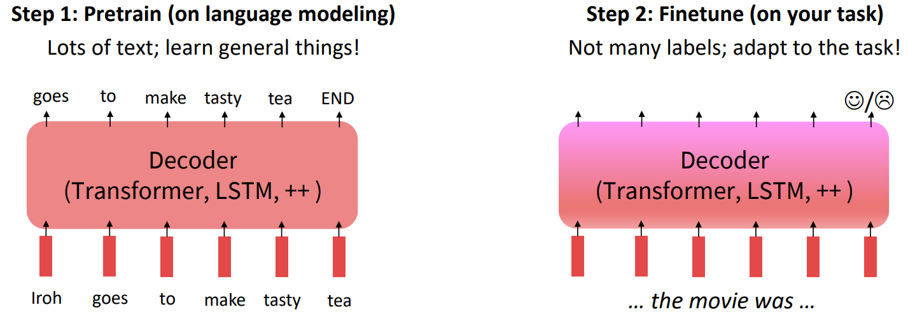

### Stochastic gradient descent and pretrain/finetune

Why should pretraining and finetuning help, from a “training neural nets” perspective?

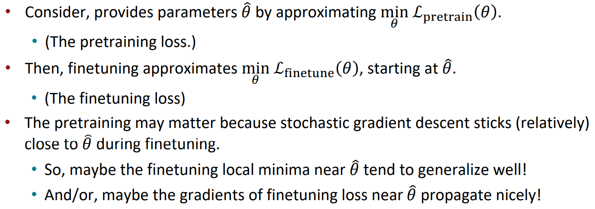

## Model pretraining three ways

### Pretraining for three types of architectures

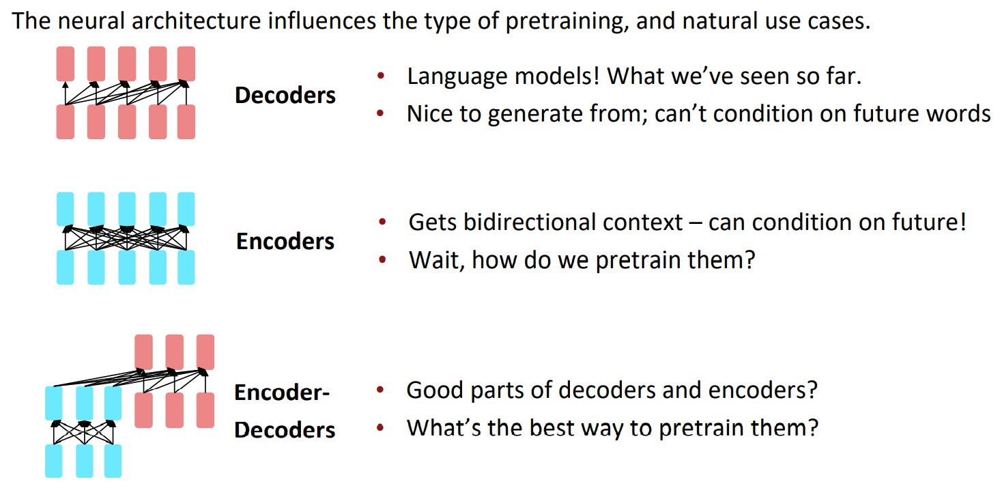

### Pretraining decoders

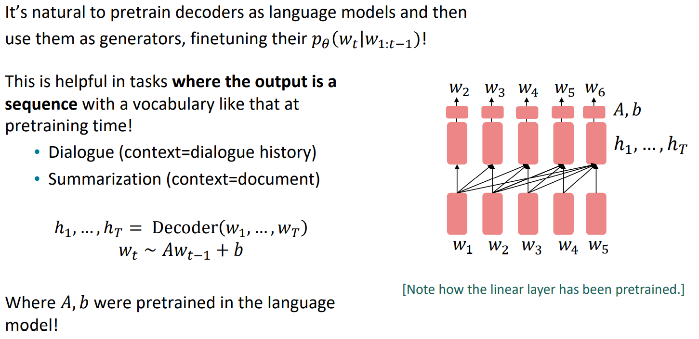

#### Generative Pretrained Transformer (GPT) [Radford et al., 2018]

2018’s GPT was a big success in pretraining a decoder! 

- Transformer decoder with 12 layers. 
- 768-dimensional hidden states, 3072-dimensional feed-forward hidden layers. 
- Byte-pair encoding with 40,000 merges 
- Trained on BooksCorpus: over 7000 unique books. 
  - Contains long spans of contiguous text, for learning long-distance dependencies. 
- The acronym “GPT” never showed up in the original paper; it could stand for  “Generative PreTraining” or “Generative Pretrained Transformer”

#### Increasingly convincing generations (GPT2) [Radford et al., 2018]

We mentioned how pretrained decoders can be used in their capacities as language models. GPT-2, a larger version of GPT trained on more data, was shown to produce relatively  convincing samples of natural language.

### Pretraining encoders

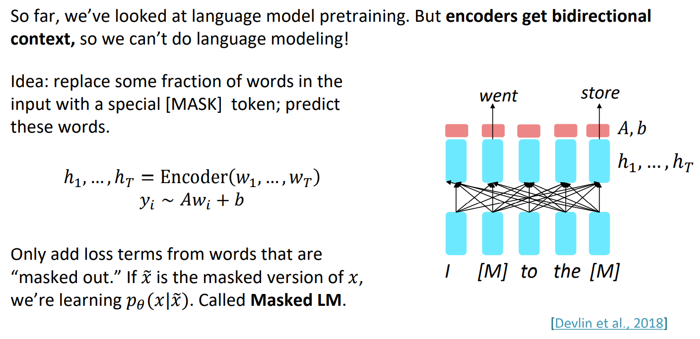

#### BERT: Bidirectional Encoder Representations from Tranformers

Some more details about Masked LM for BERT: 

- Predict a random 15% of (sub)word tokens. 
  - Replace input word with [MASK] 80% of the time 
  - Replace input word with a random token 10% of  the time 
  - Leave input word unchanged 10% of the time (but still predict it!) 
- Why? Doesn’t let the model get complacent and not  build strong representations of non-masked words. (No masks are seen at fine-tuning time!)

The pretraining input to BERT was two separate contiguous chunks of text:

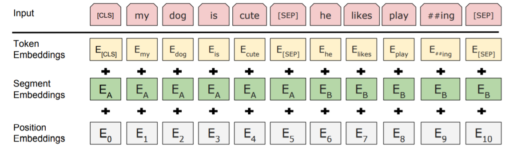

BERT was trained to predict whether one chunk follows the other or is randomly  sampled. 

- Later work has argued this “next sentence prediction” is not necessary.

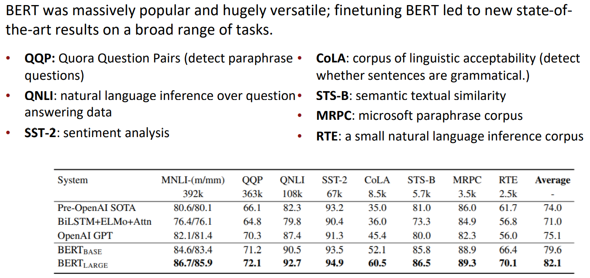

#### Limitations of pretrained encoders

Those results looked great! Why not used pretrained encoders for everything? 

If your task involves generating sequences, consider using a pretrained decoder; BERT and other  pretrained encoders don’t naturally lead to nice autoregressive (1-word-at-a-time) generation  methods.

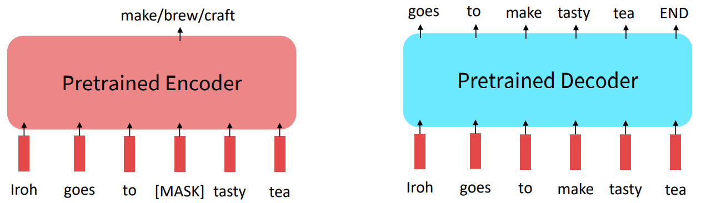

#### Extensions of BERT

You’ll see a lot of BERT variants like RoBERTa, SpanBERT, +++ 

Some generally accepted improvements to the BERT pretraining formula: 

- RoBERTa: mainly just train BERT for longer and remove next sentence prediction! 
- SpanBERT: masking contiguous spans of words makes a harder, more useful pretraining task

#### Pretraining encoder-decoders

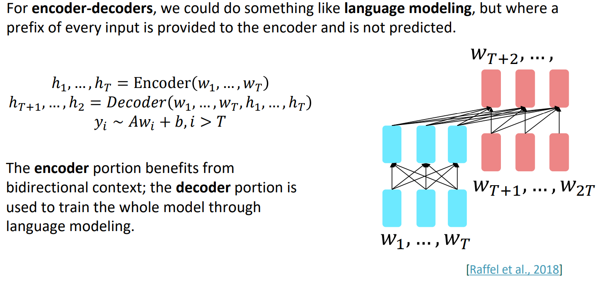

What Raffel et al., 2018 found to work best was span corruption. Their model: T5.

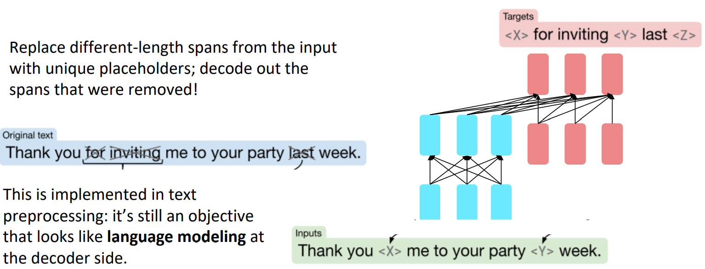

## Very large models and in-context learning

### GPT-3, In-context learning, and very large models

So far, we’ve interacted with pretrained models in two ways: 

- Sample from the distributions they define (maybe providing a prompt) 
- Fine-tune them on a task we care about, and take their predictions. 

Very large language models seem to perform some kind of learning without gradient  steps simply from examples you provide within their contexts. 

GPT-3 is the canonical example of this. The largest T5 model had 11 billion parameters. 

GPT-3 has 175 billion parameters.

## Links

- [Note](https://web.stanford.edu/class/cs224n/readings/cs224n-2019-notes07-QA.pdf)
- [The Illustrated BERT, ELMo, and co.](http://jalammar.github.io/illustrated-bert/)