# Question Answering

## What is question answering?

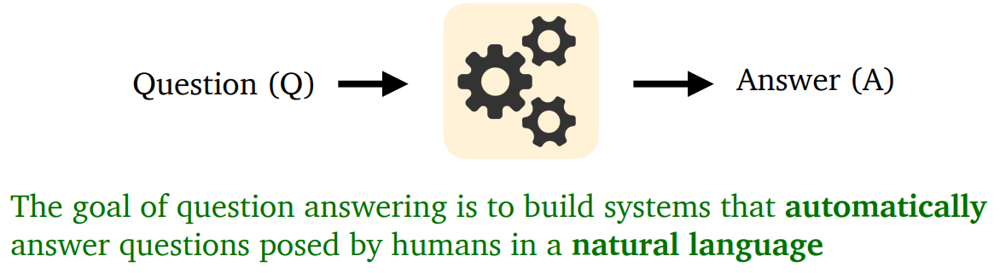

- What information source does a system build on?
  - A text passage, all Web documents, knowledge bases, tables, images..
- Question type
  - Factoid vs non-factoid, open-domain vs closed-domain, simple vs compositional, .. 
- Answer type
  - A short segment of text, a paragraph, a list, yes/no, …

### Question answering in deep learning era

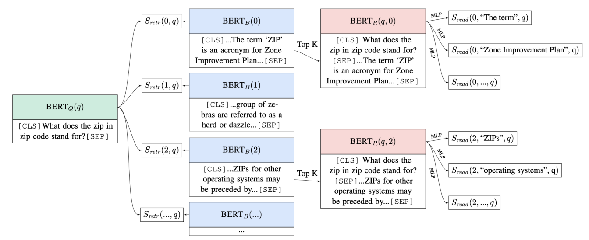

## Reading comprehension

**Reading comprehension** = comprehend a passage of text and answer questions about its content (P, Q) ⟶ A

### Stanford question answering dataset (SQuAD)

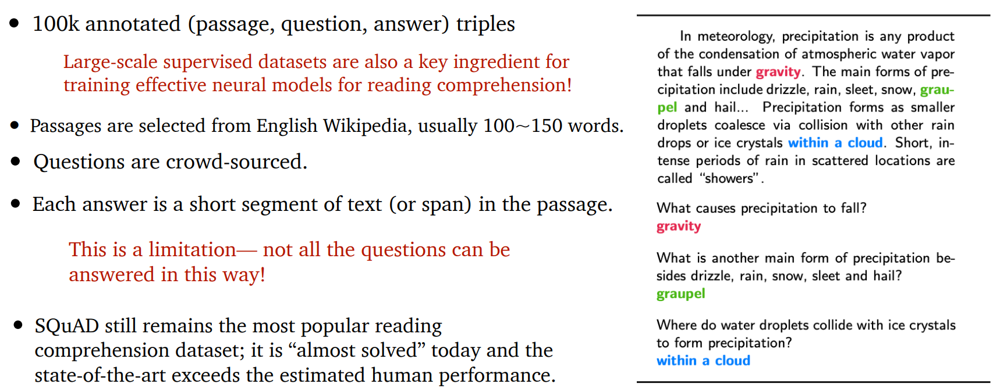

- **Evaluation**: exact match (0 or 1) and F1 (partial credit). 
- For development and testing sets, 3 gold answers are collected, because there could be  multiple plausible answers. 
- We compare the predicted answer to each gold answer (a, an, the, punctuations are  removed) and take max scores. Finally, we take the average of all the examples for both  exact match and F1. 
- Estimated human performance: EM = 82.3, F1 = 91.2

### Neural models for reading comprehension

How can we build a model to solve SQuAD? (We are going to use passage, paragraph and context, as well as question and query interchangeably)

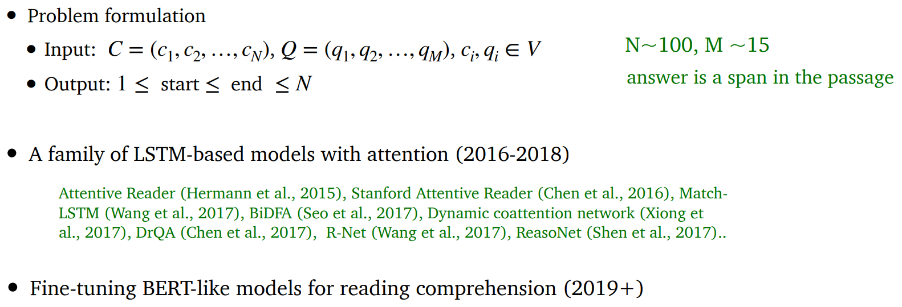

### LSTM-based vs BERT models

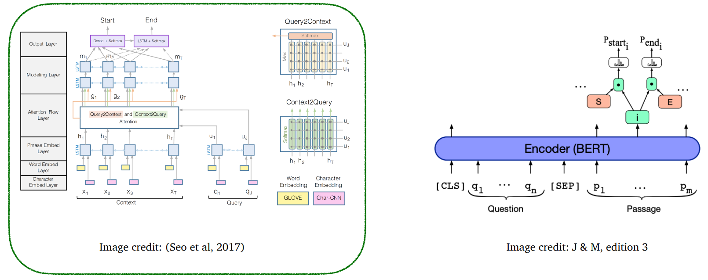

### BiDAF: the Bidirectional Attention Flow model

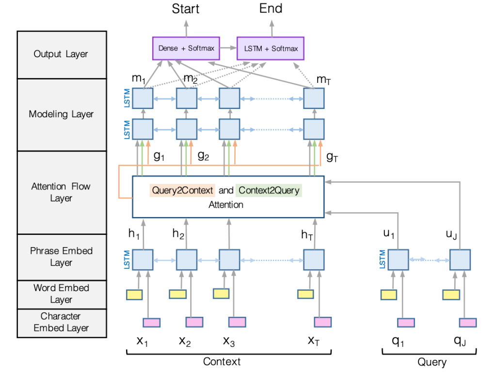

#### Encoding

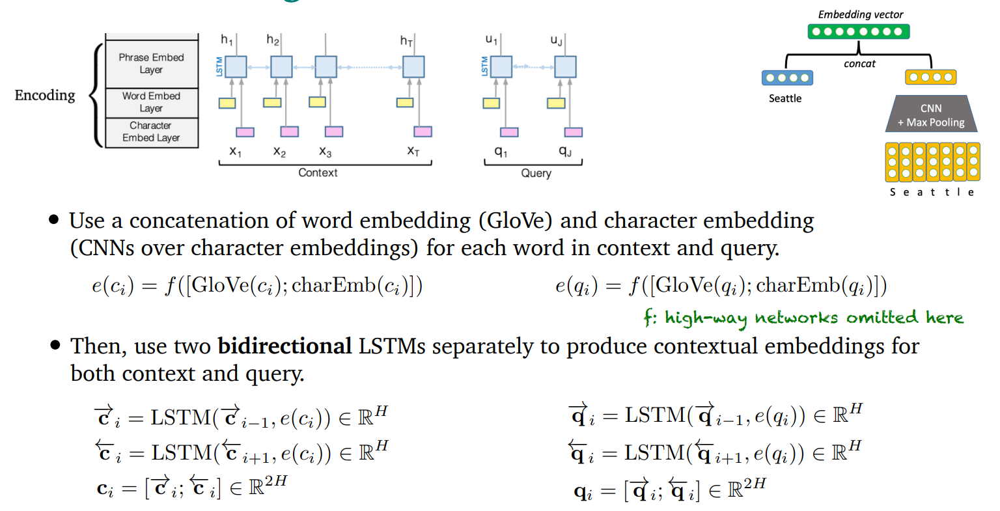

#### Attention

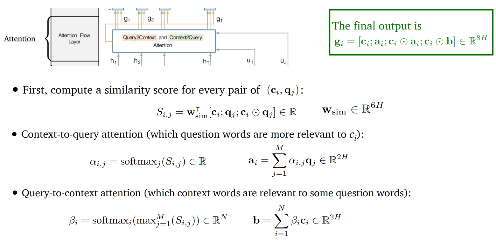

#### Modeling and output layers

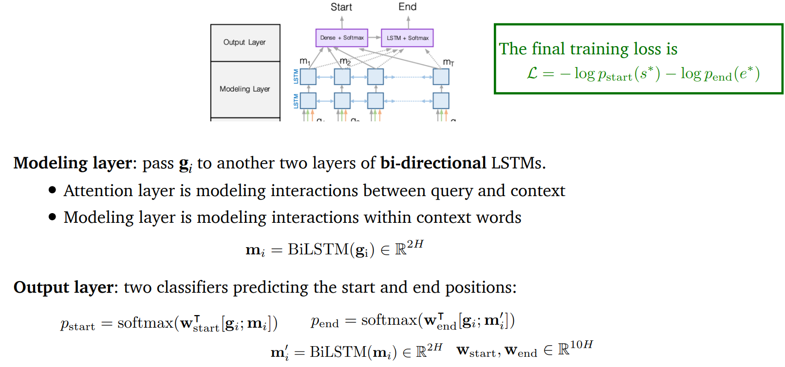

### BERT for reading comprehension

- BERT is a deep bidirectional Transformer encoder pre-trained on large amounts of text  (Wikipedia + BooksCorpus) 
- BERT is pre-trained on two training objectives: 
  - Masked language model (MLM) 
  - Next sentence prediction (NSP) 
- BERTbase has 12 layers and 110M parameters, BERTlarge has 24 layers and 330M parameters

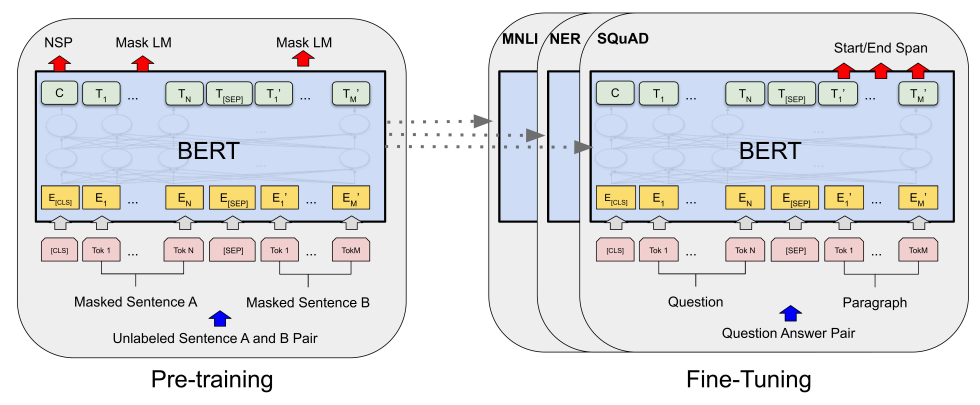

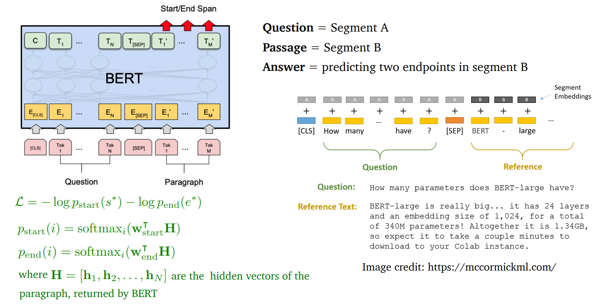

### Comparisons between BiDAF and BERT models

- BERT model has many many more parameters (110M or 330M) and BiDAF has  ~2.5M parameters. 
- BiDAF is built on top of several bidirectional LSTMs while BERT is built on top of  Transformers (no recurrence architecture and easier to parallelize).  
- BERT is pre-trained while BiDAF is only built on top of GloVe (and all the remaining  parameters need to be learned from the supervision datasets).

Are they really fundamentally different? Probably not. 

- BiDAF and other models aim to model the interactions between question and passage.  
- BERT uses self-attention between the concatenation of question and passage =  attention(P, P) + attention(P, Q) + attention(Q, P) + attention(Q, Q) 
- (Clark and Gardner, 2018) shows that adding a self-attention layer for the passage  attention(P, P) to BiDAF also improves performance

### Can we design better pre-training objectives?

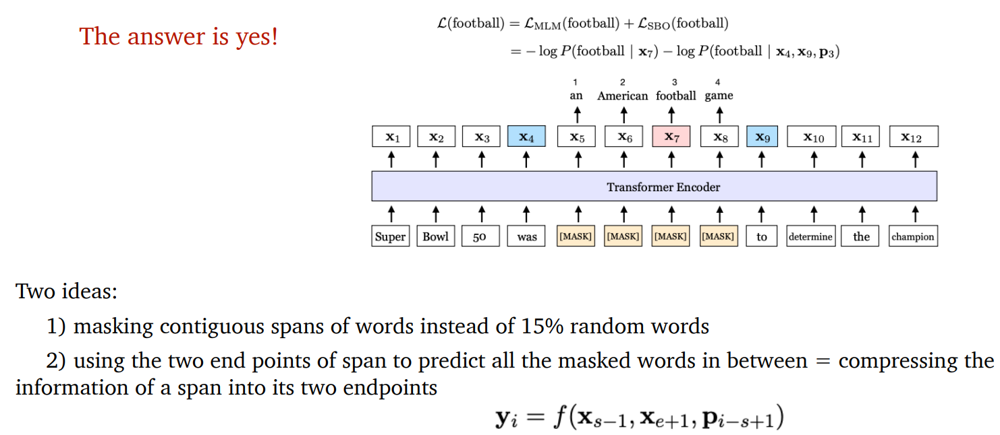

(Joshi & Chen et al., 2020): SpanBERT: Improving Pre-training by Representing and Predicting Spans

## Open-domain (textual) question answering

- Different from reading comprehension, we don’t assume a given passage.  
- Instead, we only have access to a large collection of documents (e.g., Wikipedia). We  don’t know where the answer is located, and the goal is to return the answer for any  open-domain questions.  
- Much more challenging but a more practical problem!

### Retriever-reader framework

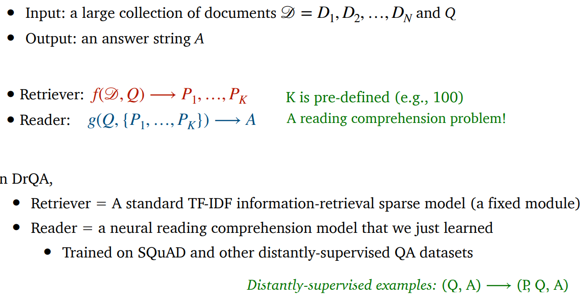

### We can train the retriever too

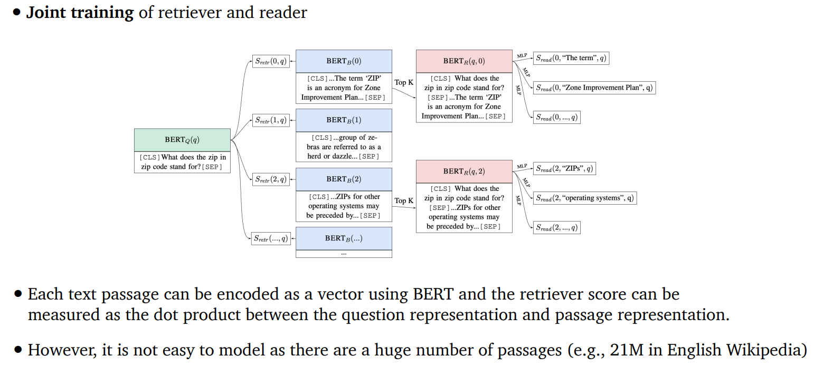

### Dense retrieval + generative models

Recent work shows that it is beneficial to generate answers instead of to extract answers.

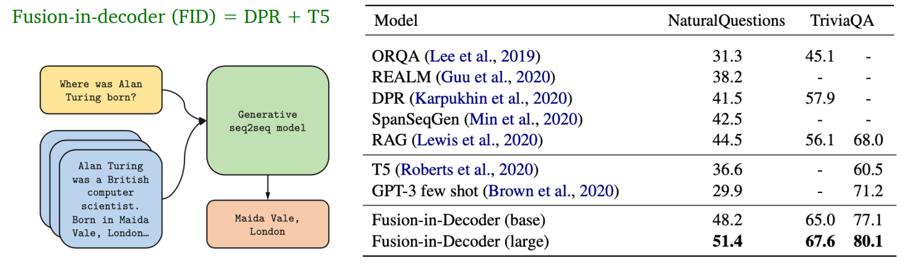

### Maybe the reader model is not necessary too!

It is possible to encode all the phrases (60 billion phrases in Wikipedia) using dense vectors and only do nearest neighbor search without a BERT model at inference time!

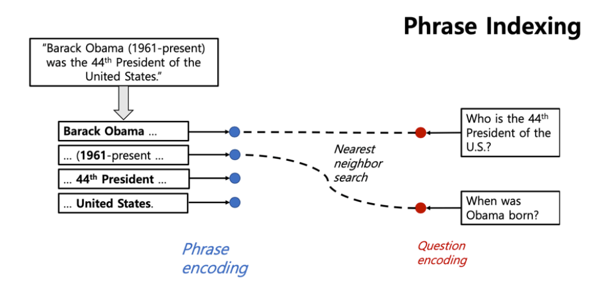

## Links

- [Danqi’s Github](https://github.com/danqi)
- [ACL2020 Tutorial: Open-Domain Question Answering](https://github.com/danqi/acl2020-openqa-tutorial)

