# Natural Language Generation

## What is natural language generation?

Any task involving text production for human  consumption requires natural language generation 

Deep Learning is powering next-gen NLG systems!

- Machine Translation
- Dialogue Systems
- Summarization
- Data-to-Text Generation
- Visual Description
- Creative Generation

## Formalizing NLG: a simple model and training algorithm

### Basics of natural language generation

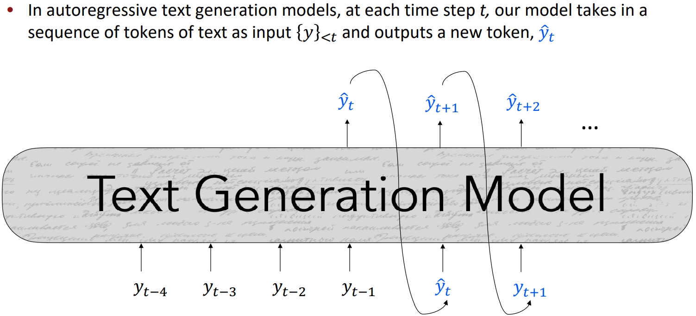

### A look at a single step

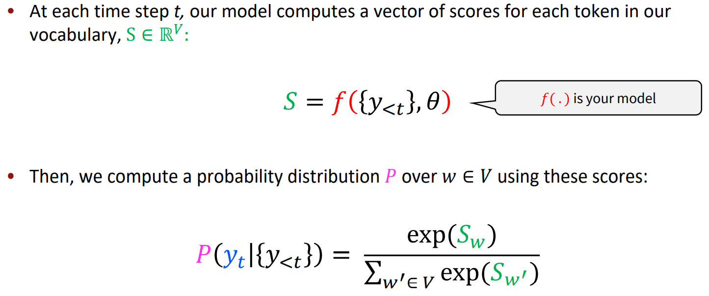

### Basics: What are we trying to do?

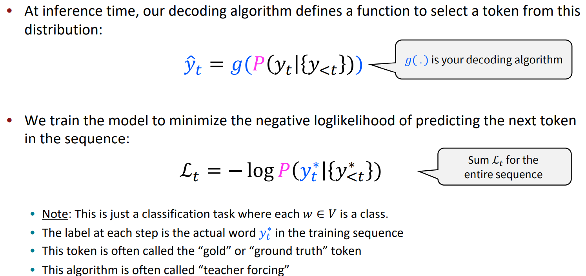

### Maximum Likelihood Training

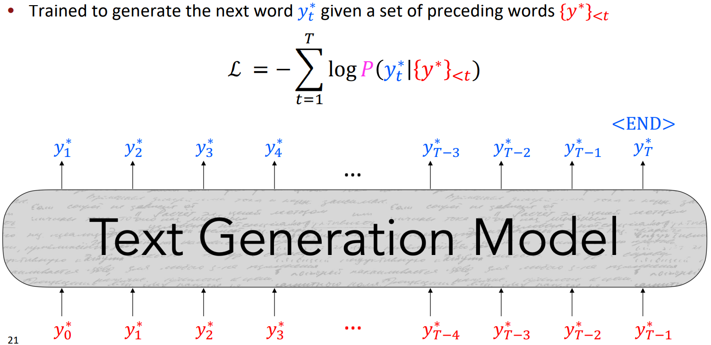

## Decoding from NLG models

### Decoding: what is it all about?

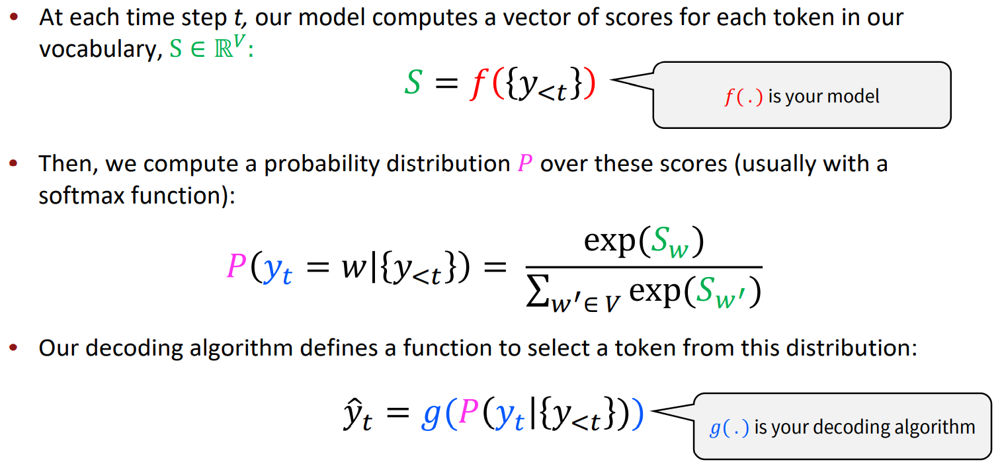

### How can we reduce repetition?

Simple option: 

- Heuristic: Don’t repeat n-grams 

More complex: 

- Minimize embedding distance between consecutive sentences (Celikyilmaz et al., 2018) 
  - Doesn’t help with intra-sentence repetition 
- Coverage loss (See et al., 2017) 
  - Prevents attention mechanism from attending to the same words 
- Unlikelihood objective (Welleck et al., 2020) 
  - Penalize generation of already-seen tokens

### Decoding: Top-k sampling

- Problem: Vanilla sampling makes every token in the vocabulary an option 
  - Even if most of the probability mass in the distribution is over a limited set of  options, the tail of the distribution could be very long 
  - Many tokens are probably irrelevant in the current context  
  - Why are we giving them individually a tiny chance to be selected? 
  - Why are we giving them as a group a high chance to be selected? 
- Solution: Top-k sampling 
  - Only sample from the top k tokens in the probability distribution

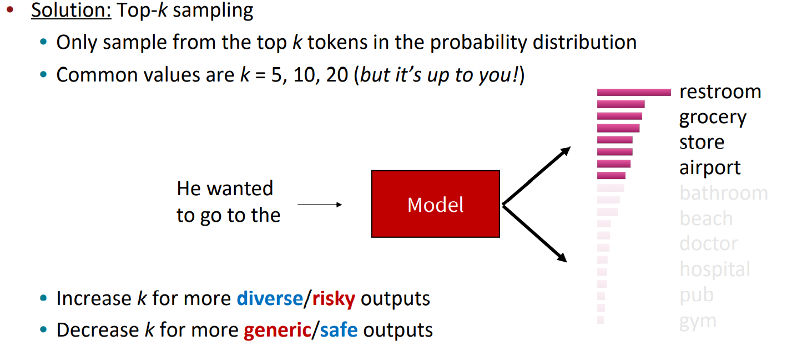

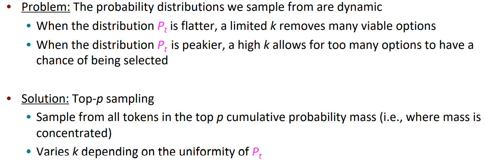

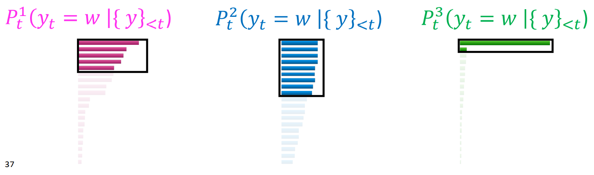

### Scaling randomness: Softmax temperature

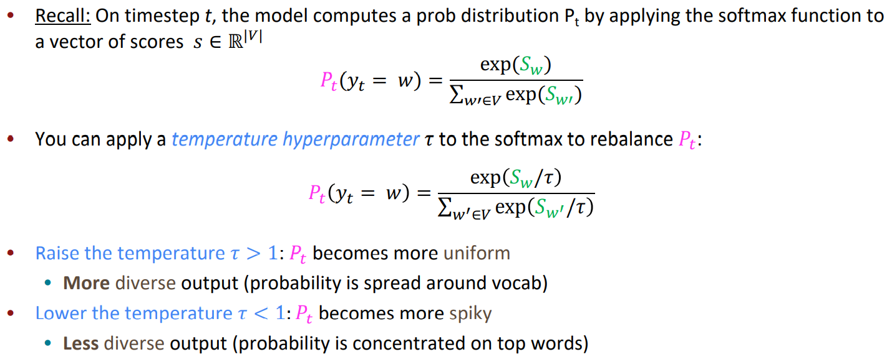

### Improving decoding: re-balancing distributions

Problem: What if I don’t trust how well my model’s distributions are calibrated? 

- Don’t rely on ONLY your model’s distribution over tokens

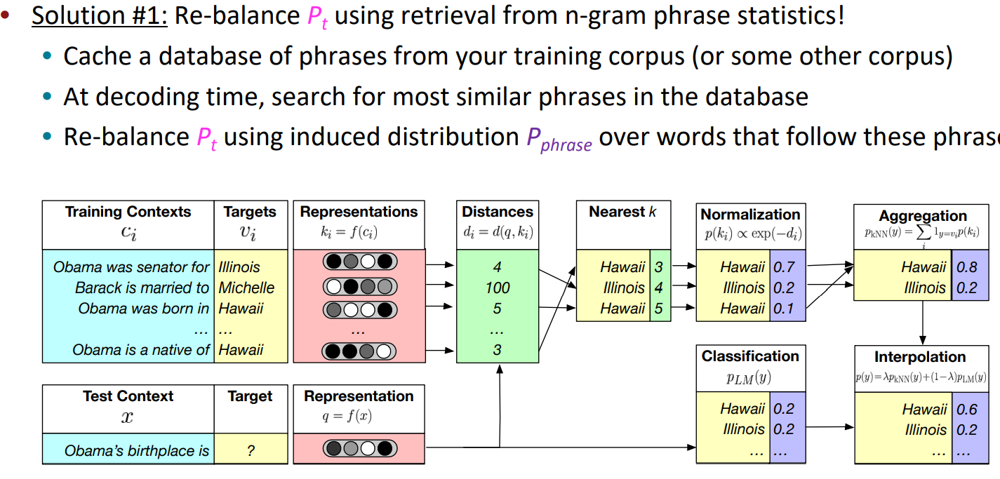

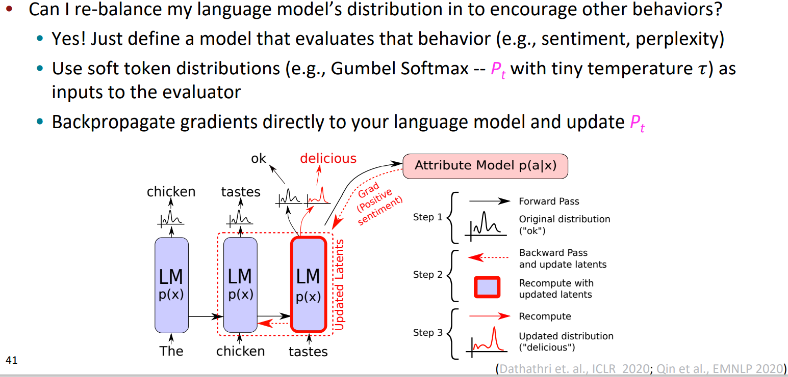

### Improving Decoding: Re-ranking

- Problem: What if I decode a bad sequence from my model? 
- Decode a bunch of sequences 
  - 10 candidates is a common number, but it’s up to you 
- Define a score to approximate quality of sequences and re-rank by this score 
  - Simplest is to use perplexity! 
    - Careful! Remember that repetitive methods can generally get high perplexity. 
  - Re-rankers can score a variety of properties:  
    - style (Holtzman et al., 2018), discourse (Gabriel et al., 2021), entailment/factuality (Goyal et al.,  2020), logical consistency (Lu et al., 2020), and many more… 
    - Beware poorly-calibrated re-rankers 
  - Can use multiple re-rankers in parallel

### Decoding: Takeaways

- Decoding is still a challenging problem in natural language generation 
- Human language distribution is noisy and doesn’t reflect simple properties (i.e.,  probability maximization) 
- Different decoding algorithms can allow us to inject biases that encourage different  properties of coherent natural language generation 
- Some of the most impactful advances in NLG of the last few years have come from  simple, but effective, modifications to decoding algorithms

## Training NLG models 

### Unlikelihood Training

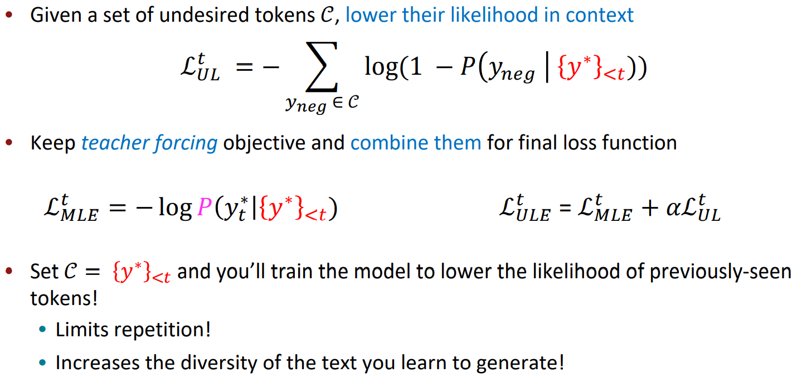

### Exposure Bias Solutions

- Scheduled sampling (Bengio et al., 2015) 
  - With some probability p, decode a token and feed that as the next input, rather than  the gold token.  
  - Increase p over the course of training 
  - Leads to improvements in practice, but can lead to strange training objectives 
- Dataset Aggregation (DAgger; Ross et al., 2011) 
  - At various intervals during training, generate sequences from your current model 
  - Add these sequences to your training set as additional examples

- Sequence re-writing (Guu*, Hashimoto* et al., 2018) 
  - Learn to retrieve a sequence from an existing corpus of human-written prototypes  (e.g., dialogue responses) 
  - Learn to edit the retrieved sequence by adding, removing, and modifying tokens in  the prototype 
- Reinforcement Learning: cast your text generation model as a Markov decision process 
  - State s is the model’s representation of the preceding context 
  - Actions a are the words that can be generated 
  - Policy  is the decoder 
  - Rewards r are provided by an external score 
  - Learn behaviors by rewarding the model when it exhibits them

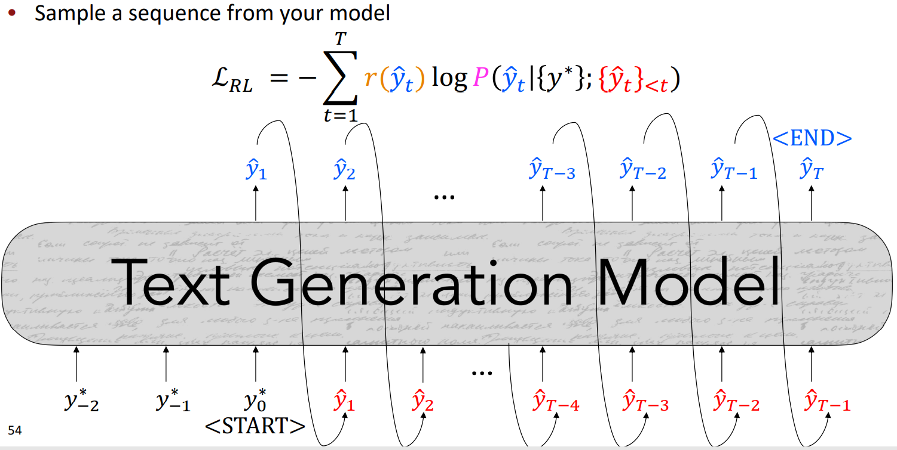

### Reward Estimation

- How should we define a reward function? Just use your evaluation metric! 
  - BLEU (machine translation; Ranzato et al., ICLR 2016; Wu et al., 2016) 
  - ROUGE (summarization; Paulus et al., ICLR 2018; Celikyilmaz et al., NAACL 2018) 
  - CIDEr (image captioning; Rennie et al., CVPR 2017) 
  - SPIDEr (image captioning; Liu et al., ICCV 2017) 
- Be careful about optimizing for the task as opposed to “gaming” the reward! 
  - Evaluation metrics are merely proxies for generation quality! 
  - “even though RL refinement can achieve better BLEU scores, it barely improves the  human impression of the translation quality” – Wu et al., 2016

- What behaviors can we tie to rewards? 
  - Cross-modality consistency in image captioning (Ren et al., CVPR 2017) 
  - Sentence simplicity (Zhang and Lapata, EMNLP 2017) 
  - Temporal Consistency (Bosselut et al., NAACL 2018) 
  - Utterance Politeness (Tan et al., TACL 2018) 
  - Paraphrasing (Li et al., EMNLP 2018) 
  - Sentiment (Gong et al., NAACL 2019) 
  - Formality (Gong et al., NAACL 2019)

### The dark side…

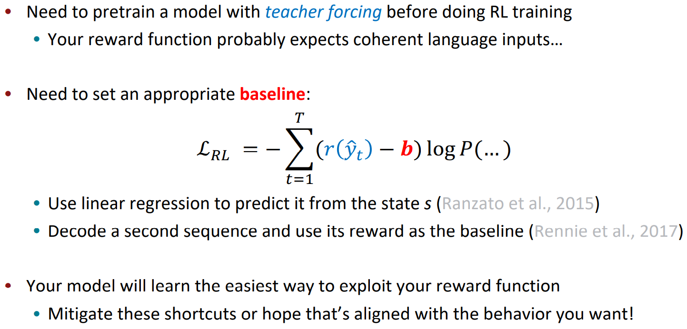

### Training: Takeaways

- Teacher forcing is still the premier algorithm for training text generation models 
- **Diversity** is an issue with sequences generated from teacher forced models 
  - New approaches focus on mitigating the effects of common words 
- **Exposure bias** causes text generation models to lose coherence easily 
  - Models must learn to recover from their own bad samples (e.g., scheduled sampling,  DAgger) 
  - Or not be allowed to generate bad text to begin with (e.g., retrieval + generation) 
- Training with RL can allow models to learn behaviors that are challenging to formalize 
  - Learning can be very unstable!

## Evaluating NLG Systems 

### Types of evaluation methods for text generation

- Content Overlap Metrics
- Model-based Metrics
- Human Evaluations

### Content overlap metrics

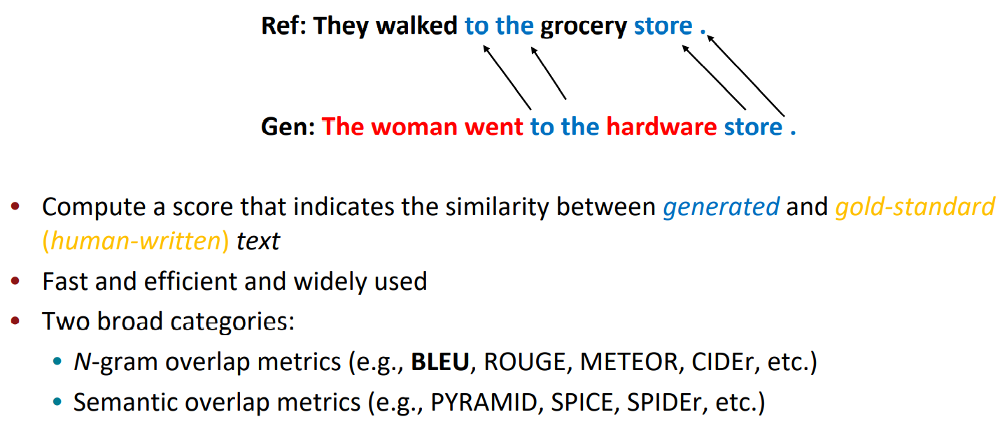

#### N-gram overlap metrics

Word overlap based metrics (BLEU, ROUGE, METEOR, CIDEr, etc.) 

- They’re not ideal for machine translation 
- They get progressively much worse for tasks that are more open-ended than machine  translation 
  - Worse for summarization, as longer output texts are harder to measure 
  - Much worse for dialogue, which is more open-ended that summarization

#### Semantic overlap metrics

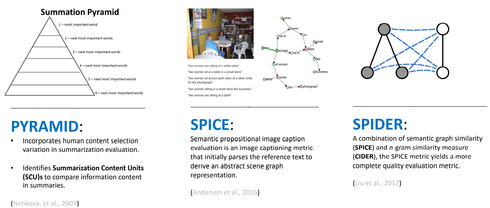

### Model-based metrics

- Use learned representations of words and  sentences to compute semantic similarity  between generated and reference texts 
- No more n-gram bottleneck because text  units are represented as embeddings! 
- Even though embeddings are pretrained,  distance metrics used to measure the  similarity can be fixed

#### Word distance functions

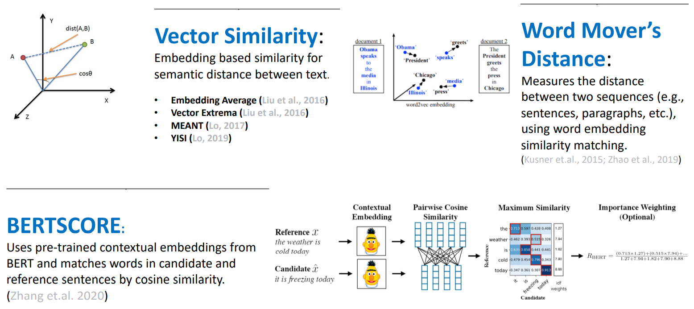

#### Beyond word matching

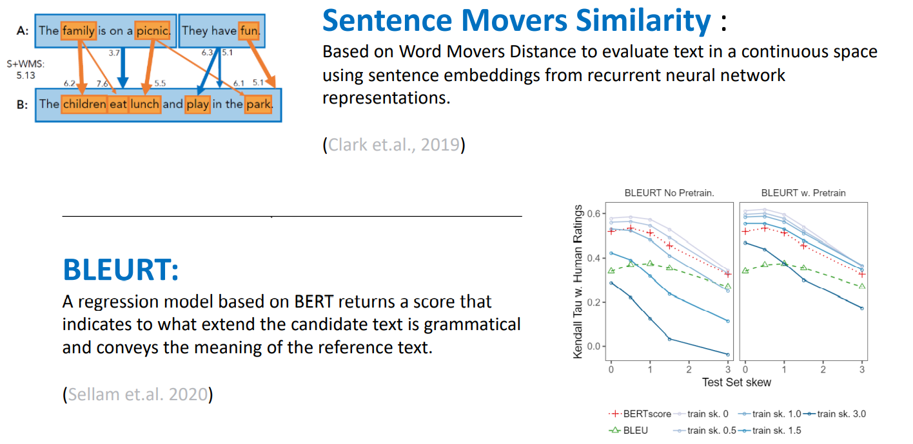

### Human evaluations

- Automatic metrics fall short of matching human decisions 
- Most important form of evaluation for text generation systems 
  - more than 75% generation papers at ACL 2019 include human evaluations 
- Gold standard in developing new automatic metrics 
  - New automated metrics must correlate well with human evaluations!

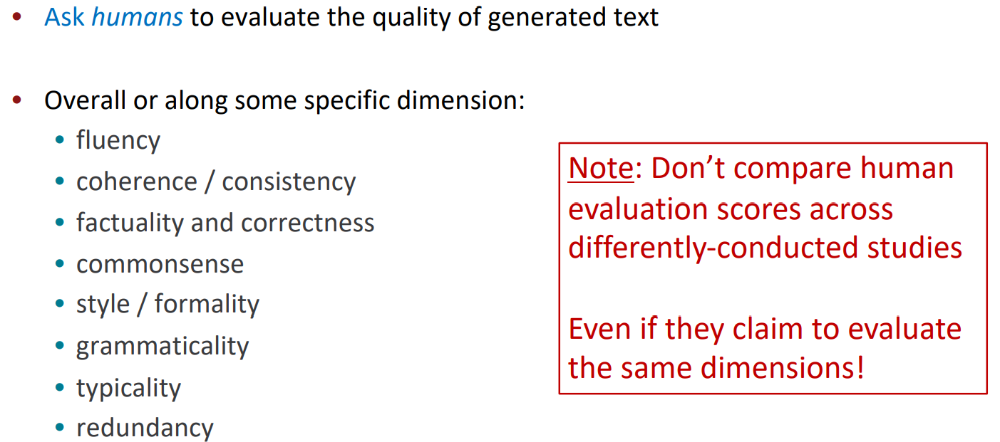

#### Learning from human feedback

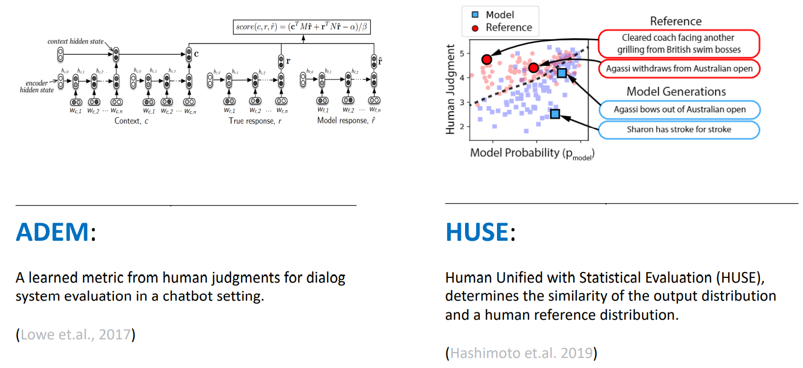

### Evaluation: Takeaways

- Content overlap metrics provide a good starting point for evaluating the quality of  generated text, but they’re not good enough on their own. 
- Model-based metrics are can be more correlated with human judgment, but behavior is  not interpretable 
- Human judgments are critical. 
  - Only ones that can directly evaluate factuality – is the model saying correct things? 
  - But humans are inconsistent! 
- In many cases, the best judge of output quality is YOU! 
  - Look at your model generations. Don’t just rely on numbers!

## Ethical Considerations

### Ethics: Biases in text generation models

- Text generation models are often  constructed from pretrained language  models 
- Language models learn harmful patterns  of bias from large language corpora  
- When prompted for this information,  they repeat negative stereotypes

### Hidden Biases: Universal adversarial triggers

- The learned behaviors of text  generation models are opaque 
- Adversarial inputs can trigger VERY  toxic content 
- These models can be exploited in  open-world contexts by illintentioned user

### Concluding Thoughts

- Interacting with natural language generation systems quickly shows their limitations 
- Even in tasks with more progress, there are still many improvements ahead 
- Evaluation remains a huge challenge.  
  - We need better ways of automatically evaluating performance of NLG systems
-  With the advent of large-scale language models, deep NLG research has been reset 
  - it’s never been easier to jump in the space! 
- One of the most exciting areas of NLP to work in

## Links

- [Antoine Bosselut](https://atcbosselut.github.io/)

