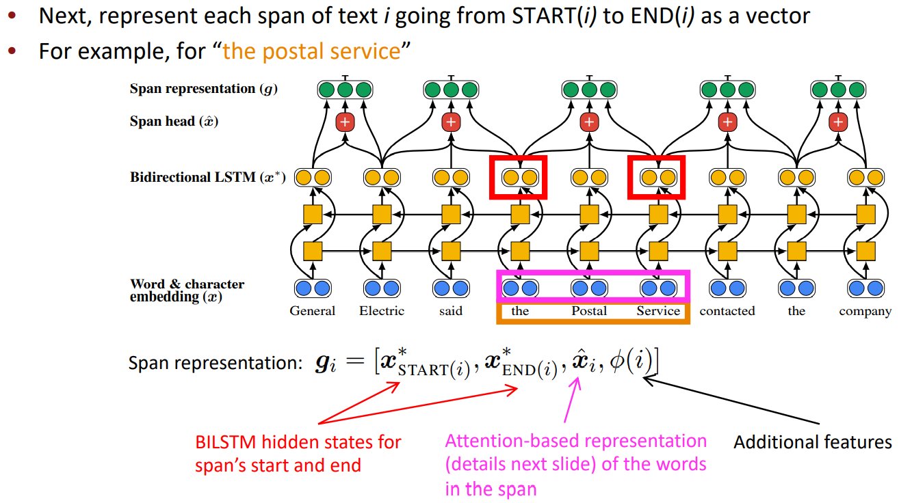

# Reference in Language and Coreference Resolution

## What is Coreference Resolution?

### Coreference Resolution in Two Steps

1. Detect the mentions (easy)
2. Cluster the mentions (hard)

## Mention Detection

- **Mention**: A span of text referring to some entity

- Three kinds of mentions:
  - Pronouns: I, your, it, she, him, etc. 
    - Use a part-of-speech tagger
  - Named entities: People, places, etc.: Paris, Joe Biden, Nike 
    - Use a Named Entity Recognition system
  - Noun phrases: “a dog,” “the big fluffy cat stuck in the tree”
    - Use a parser (especially a constituency parser – next week!)

- For detection: traditionally, use a pipeline of other NLP systems

We could instead train a classifier specifically for mention  detection instead of using a POS tagger, NER system, and parser.

## On to Coreference! First, some linguistics

- **Coreference** is when two mentions refer to the same entity in  the world

- A different-but-related linguistic concept is **anaphora**: when a  term (**anaphor**[隐喻]) refers to another term (**antecedent**[先行词]) 
  - the interpretation of the anaphor is in some way determined  by the interpretation of the antecedent

### Anaphora vs. Coreference

- Not all anaphoric relations are coreferential 
  - We went to see a concert last night. The tickets were really expensive.

- This is referred to as bridging anaphora.

### Anaphora vs. Cataphora

Usually the antecedent comes before the anaphor (e.g., a pronoun), but not always

### Four Kinds of Coreference Models

- Rule-based (pronominal anaphora resolution) 
- Mention Pair 
- Mention Ranking 
- Clustering [skipping this year; see Clark and Manning (2016)]

## Traditional pronominal anaphora resolution:  Hobbs’ naive algorithm

## Coreference Models: Mention Pair

## Coreference Models: Mention Ranking

### Training

### How do we compute the probabilities?

A. Non-neural statistical classifier 

B. Simple neural network 

C. More advanced model using LSTMs, attention, transformers

### Neural Coref Model

- Standard feed-forward neural network  
  - Input layer: word embeddings and a few categorical features

#### Inputs

Embeddings 

- Previous two words, first word, last word, head word, … of each  mention

Still need some other features to get a strongly performing model: 

- Distance 
- Document genre 
- Speaker information

## Convolutional Neural Nets

## End-to-end Neural Coref Model

- Current state-of-the-art models for coreference resolution  
  - Kenton Lee et al. from UW (EMNLP 2017) et seq. 
- Mention ranking model 
- Improvements over simple feed-forward NN 
  - Use an LSTM 
  - Use attention 
  - Do mention detection and coreference end-to-end 
    - No mention detection step! 
    - Instead consider every span of text (up to a certain length) as a candidate mention ：a span is just a contiguous sequence of words

### BERT-based coref: Now has the best results!

- Pretrained transformers can learn long-distance semantic dependencies in text. 
- Idea 1, SpanBERT: Pretrains BERT models to be better at span-based prediction tasks  like coref and QA 
- Idea 2, BERT-QA for coref: Treat Coreference like a deep QA task 
  - “Point to” a mention, and ask “what is its antecedent” 
  - Answer span is a coreference link

## Coreference Evaluation

- Many different metrics: MUC, CEAF, LEA, B-CUBED, BLANC 
  - People often report the average over a few different metrics 
- Essentially the metrics think of coreference as a clustering task and  evaluate the quality of the clustering

### Conclusion

- Coreference is a useful, challenging, and linguistically interesting task 
  - Many different kinds of coreference resolution systems 
- Systems are getting better rapidly, largely due to better neural models 
  - But most models still make many mistakes – OntoNotes coref is easy newswire case 
- Try out a coreference system yourself! 
  - http://corenlp.run/ (ask for coref in Annotations) 
  - https://huggingface.co/coref/

## Links

- [Coreference Resolution chapter of Jurafsky and Martin](https://web.stanford.edu/~jurafsky/slp3/22.pdf)