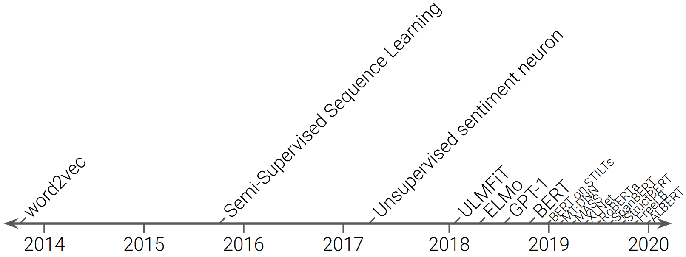
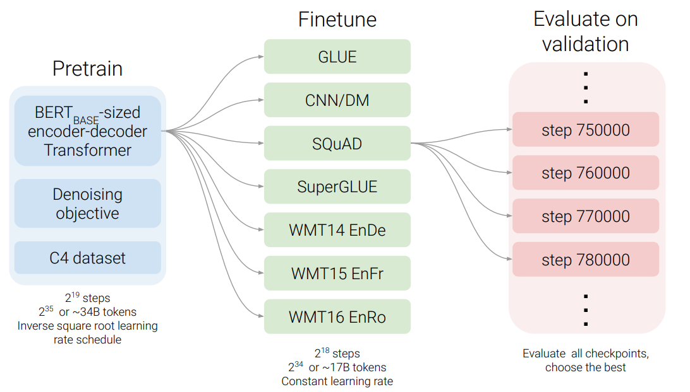
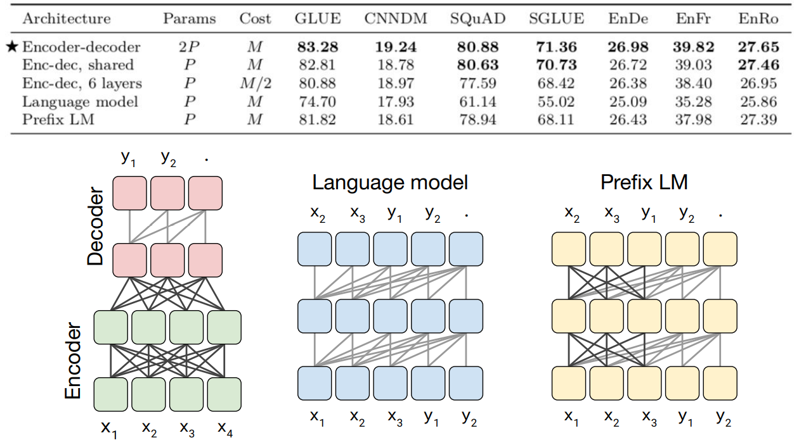
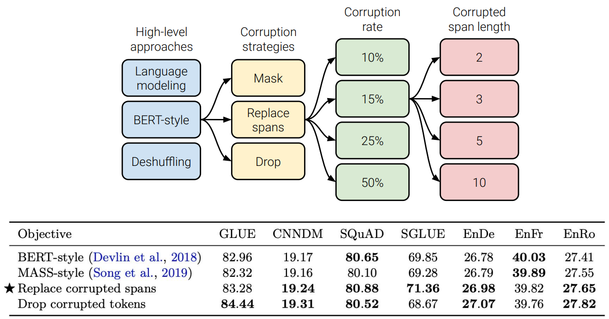
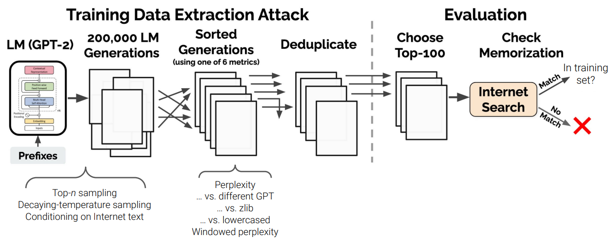

# T5 and large language models: The good, the bad, and the ugly

## Disclaimer

## Do large language  models memorize their  training data?

## Links

- [T5 Source Code](https://github.com/google-research/text-to-text-transfer-transformer)
- [mT5: A Massively Multilingual Pre-trained Text-to-Text Transformer](https://arxiv.org/pdf/2010.11934.pdf)
- [How Much Knowledge Can You Pack Into the Parameters of a Language Model?](https://arxiv.org/pdf/2002.08910.pdf)
- [Extracting Training Data from Large Language Models](https://arxiv.org/pdf/2012.07805.pdf) 
- [Do Transformer Modifications Transfer Across Implementations and Applications?](https://arxiv.org/pdf/2102.11972.pdf) 