# Integrating knowledge in language models

## What does a LM know?  

- Takeaway: predictions generally make sense (e.g. the correct types), but are not all  factually correct. 
- Why might this happen?  
  - Unseen facts: some facts may not have occurred in the training corpora at all 
  - Rare facts: LM hasn’t seen enough examples during training to memorize the fact 
  - Model sensitivity: LM may have seen the fact during training, but is sensitive to the  phrasing of the prompt 
    - Correctly answers “x was made in y” templates but not “x was created in y”  
- The inability to reliably recall knowledge is a key challenge facing LMs today!  
  - Recent works have found LMs can recover some knowledge, but have a way to go.

### The importance of knowledge-aware language models

- LM pretrained representations can benefit downstream tasks that leverage knowledge 
  - For instance, extracting the relations between two entities in a sentence is easier  with some knowledge of the entities 
  - We’ll come back to this when talking about evaluation!  
- Stretch goal: can LMs ultimately replace traditional knowledge bases?  
  - Instead of querying a knowledge base for a fact (e.g. with SQL), query the LM with a  natural language prompt! 
    - Of course, this requires LM to have high quality on recalling facts

### Advantages of language models over traditional KBs(knowledge bases)

- LMs are pretrained over large amounts of unstructured and unlabeled text 
  - KBs require manual annotation or complex NLP pipelines to populate 
- LMs support more flexible natural language queries  
  - Example: What does the final F in the song U.F.O.F. stand for?  
    - Traditional KB wouldn’t have a field for “final F”; LM may learn this 
- However, there are also many open challenges to using LMs as KBs: 
  - Hard to interpret (i.e., why does the LM produce an answer)  
  - Hard to trust (i.e., the LM may produce a realistic, incorrect answer) 
  - Hard to modify (i.e., not easy to remove or update knowledge in the LM)

## Techniques to add knowledge to LMs 

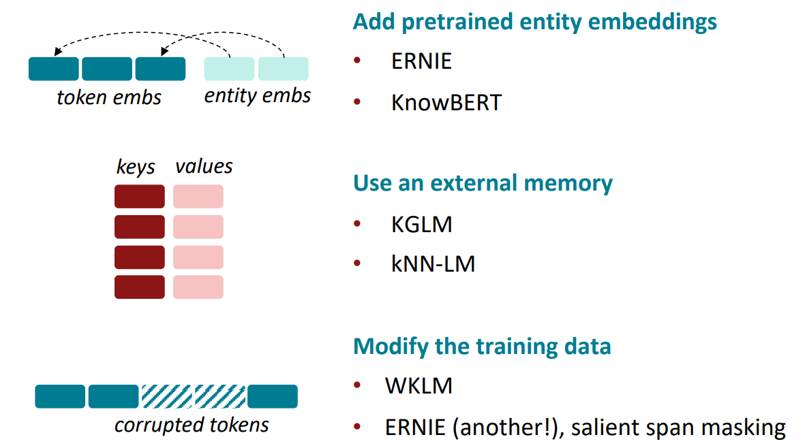

### Method 1: Add pretrained embeddings

- Facts about the world are usually in terms of entities
- Pretrained word embeddings do not have a notion of entitie
- What if we assign an embedding per entity? 
  - Single entity embedding for “U.S.A.”, “United States of America” and “America”
- Entity embeddings can be useful to LMs iff you can do entity linking well!

Many techniques for training entity embeddings:  

- Knowledge graph embedding methods (e.g., TransE) 
- Word-entity co-occurrence methods (e.g., Wikipedia2Vec) 
- Transformer encodings of entity descriptions (e.g., BLINK) 

Question: How do we incorporate pretrained entity embeddings from a different  embedding space? 

Answer: Learn a fusion layer to combine context and entity information.

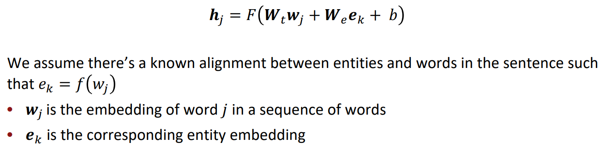

#### ERNIE: Enhanced Language Representation with Informative  Entities [Zhang et al., ACL 2019]

- Text encoder: multi-layer bidirectional Transformer encoder over the words in the sentence 
- Knowledge encoder: stacked blocks composed of:  
  - Two multi-headed attentions (MHAs) over entity embeddings and token  embeddings 
  - A fusion layer to combine the output of the MHAs

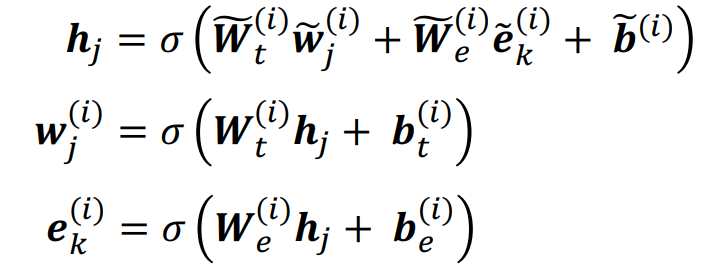

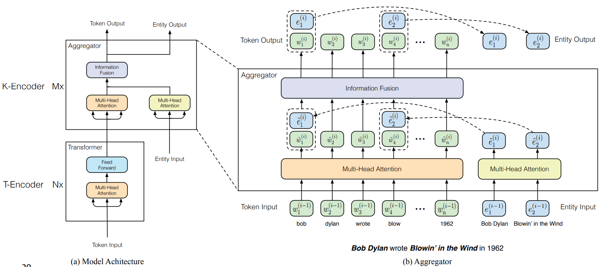

- Pretrain with three tasks:  
  - Masked language model and next sentence prediction (i.e., BERT tasks) 
  - Knowledge pretraining task (dEA1): randomly mask token-entity alignments and  predict corresponding entity for a token from the entities in the sequence

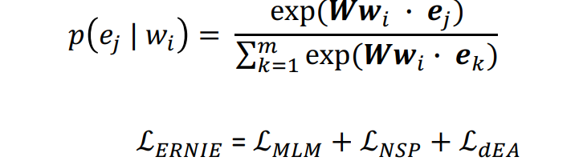

Strengths: 

- Combines entity + context info through fusion layers and a knowledge pretraining  task 
- Improves performance downstream on knowledge-driven tasks

#### Jointly learn to link entities with KnowBERT [Peters et al., EMNLP 2019]

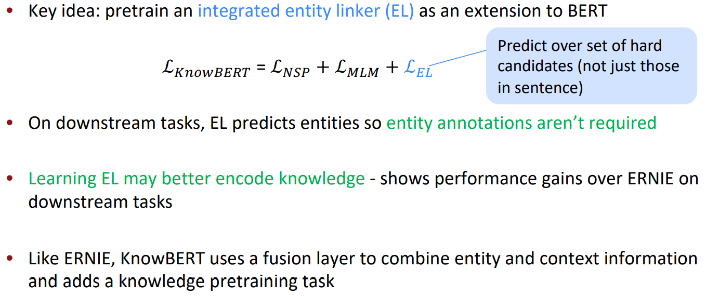

### Method 2: Use an external memory

- Previous methods rely on the pretrained entity embeddings to encode the factual  knowledge from KBs for the language model.  
- Question: Are there more direct ways than pretrained entity embeddings to provide  the model factual knowledge?  
- Answer: Yes! Give the model access to an external memory (a key-value store with  access to KG triples or context information)  
- Advantages:  
  - Can better support injecting and updating factual knowledge  
    - Often without more pretraining!  
  - More interpretable

#### Barack's Wife Hillary: Using Knowledge-Graphs for Fact-Aware  Language Modeling (KGLM) [Logan et al., ACL 2019]

- **Key idea: condition the language model on a knowledge graph (KG)**

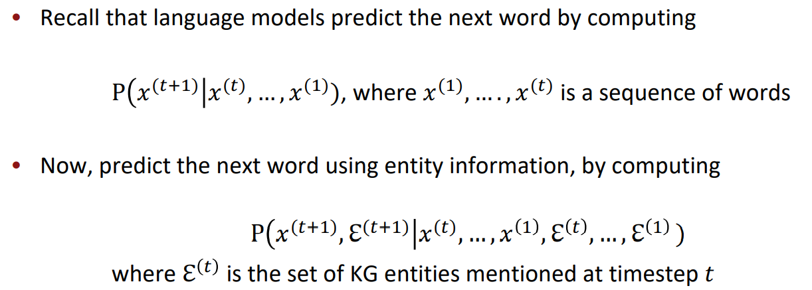

- Build a “local” knowledge graph as you iterate over the sequence 
  - Local KG: subset of the full KG with only entities relevant to the sequence

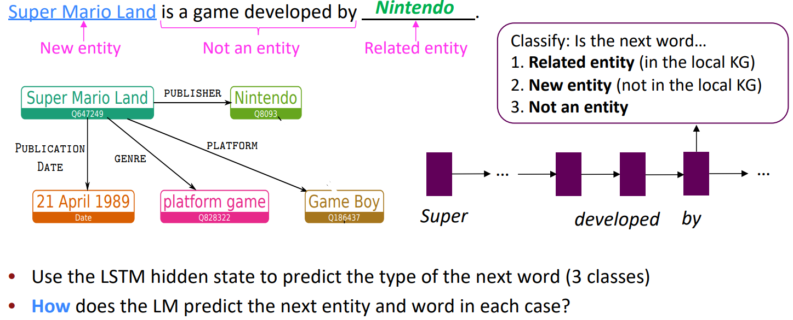

**Related entity (in the local KG)**

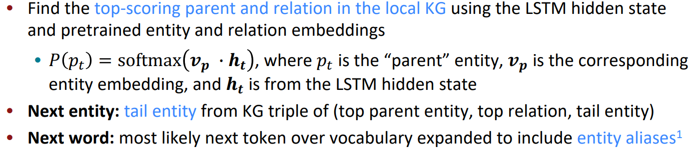

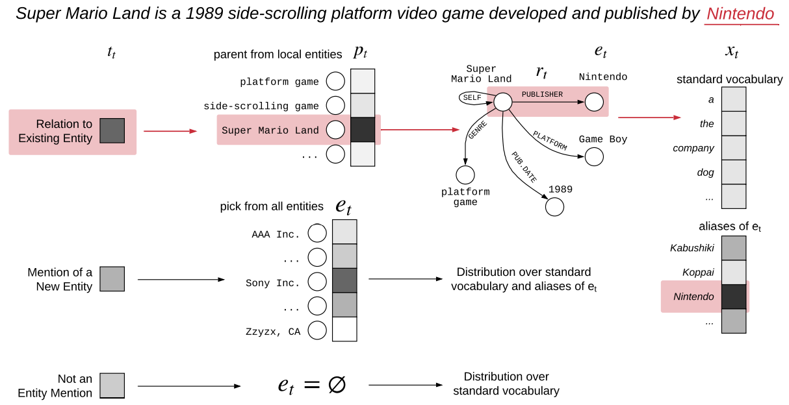

#### More recent takes: Nearest Neighbor Language Models (kNN-LM) [Khandelwal et al., ICLR 2020]

- **Key idea: learning similarities between text sequences is easier than predicting the  next word**
- store all representations of text sequences in a nearest neighbor datastore! 

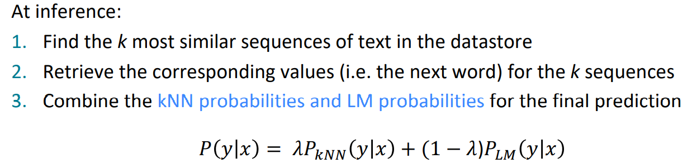

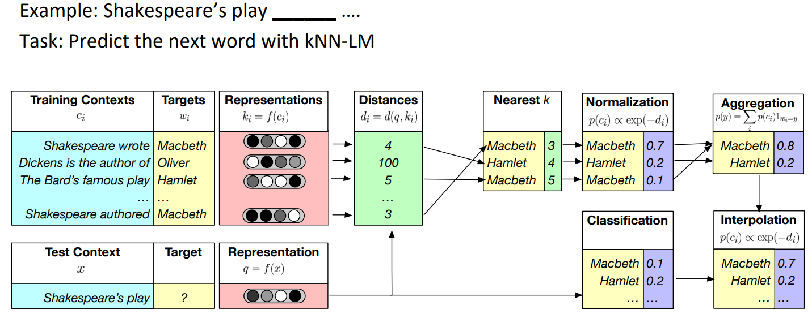

### Method 3: Modify the training data

- Previous methods incorporated knowledge explicitly through pretrained embeddings  and/or an external memory.  
- Question: Can knowledge also be incorporated implicitly through the unstructured  text?  
- Answer: Yes! Mask or corrupt the data to introduce additional training tasks that  require factual knowledge.  
- Advantages:  
  - No additional memory/computation requirements  
  - No modification of the architecture required

#### Pretrained Encyclopedia: Weakly Supervised Knowledge-Pretrained Language Model (WKLM) [Xiong et al., ICLR 2020

- **Key idea: train the model to distinguish between true and false knowledge** 
- Replace mentions in the text with mentions that refer to different entities of the same  type to create negative knowledge statements  
  - Model predicts if entity as been replaced or not  
  - Type-constraint is intended to enforce linguistically correct sentences

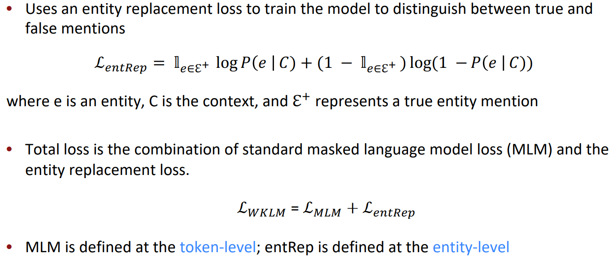

**Learn inductive biases through masking**

- Can we encourage the LM to learn factual knowledge by being clever about masking?  
- Thread in several recent works: 
  - ERNIE1: Enhanced Representation through Knowledge Integration, Sun et al., arXiv 2019 
    - Shows improvements on downstream Chinese NLP tasks with phrase-level and  entity-level masking 
  - How Much Knowledge Can You Pack Into the Parameters of a Language Model?,  Roberts et al., EMNLP 2020 
    - Uses “salient span masking” (Guu et al., ICML 2020) to mask out salient spans  (i.e. named entities and dates)  
    - Shows that salient span masking helps T5 performance on QA

#### ERNIE1: Enhanced Representation through Knowledge Integration  [Sun et al., arXiv 2019]

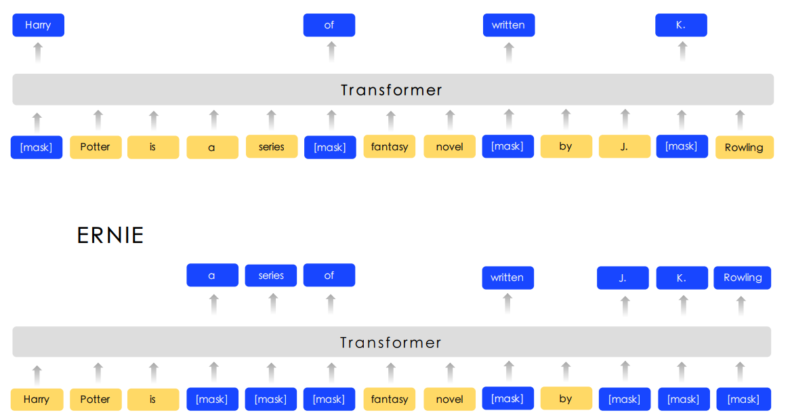

### Techniques to add knowledge to LMs

1. Use pretrained entity embeddings  
   - Often not too difficult to apply to existing architectures to leverage KG pretraining 
   - Indirect way of incorporating knowledge and can be hard to interpret
2. Add an external memory  
   - Can support some updating of factual knowledge and easier to interpret 
   - Tend to be more complex in implementation and require more memory 
3. Modify the training data  
   - Requires no model changes or additional computation. May also be easiest to  theoretically analyze! Active area of research •
   - till open question if this is always as effective as model changes

## Evaluating knowledge in LMs

### LAnguage Model Analysis (LAMA) Probe [Petroni et al., EMNLP 2019]

- How much relational (commonsense and factual)  knowledge is already in off-the-shelf language  models? 
  - Without any additional training or fine-tuning  
- Manually constructed a set of cloze statements to  assess a model’s ability to predict a missing token. 

- Generate cloze statements from KG triples and question-answer pairs  
- Compare LMs to supervised relation extraction (RE) and question answering systems 
- Goal: evaluate knowledge present in existing pretrained LMs (this means they may  have different pretraining corpora!)
- Limitations of the LAMA probe:  
  - Hard to understand why models perform well when they do  
    - BERT-large may be memorizing co-occurrence patterns rather than  “understanding” the cloze statement 
    - LM could just be identifying similarities between the surface forms of the subject  and object (e.g., Pope Clement VII has the position of pope) 
  - LMs are sensitive to the phrasing of the statement  
    - LAMA has only one manually defined template for each relation  
    - This means probe results are a lower bound on knowledge encoded in the LM

### A More Challenging Probe: LAMA-UnHelpful Names (LAMA-UHN)  [Poerner et al., EMNLP 2020]

- **Key idea: Remove the examples from LAMA that can be  answered without relational knowledge**  
- Observation: BERT may rely on surface forms of entities to  make predictions 
- String match between subject and object  
- “Revealing” person name  
  - Name can be a (possibly incorrect) prior for  native language, place of birth, nationality, etc.

### Knowledge-driven downstream tasks

- Measures how well the knowledge-enhanced LM transfers its knowledge to  downstream tasks  
- Unlike probes, this evaluation usually requires finetuning the LM on downstream  tasks, like evaluating BERT on GLUE tasks 

- Common tasks:  
  - Relation extraction  
    - Example: [Bill Gates] was born in [Seattle]; label: city of birth 
  - Entity typing  
    - Example: [Alice] robbed the bank; label: criminal 
  - Question answering  
    - Example: “What kind of forest is the Amazon?”; label: “moist broadleaf forest”

### Evaluating knowledge in LMs

- Probes 
  - Evaluate the knowledge already present in models without more training 
  - Challenging to construct benchmarks that require factual knowledge 
  - Challenge to construct the queries used in the probe 
- Downstream tasks  
  - Evaluate the usefulness of the knowledge-enhanced representation in applications 
  - Often requires finetuning the LM further on the downstream task  
  - Less direct way to evaluate the knowledge in the LM 

## Links

- [Megan Leszczynski](http://www.mleszczy.com/)

