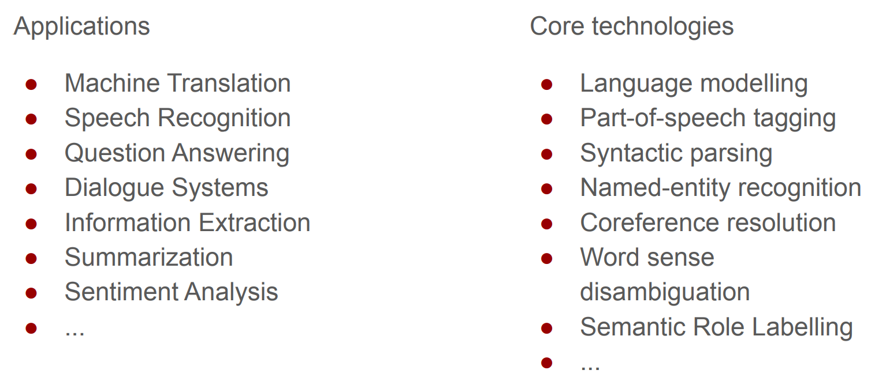
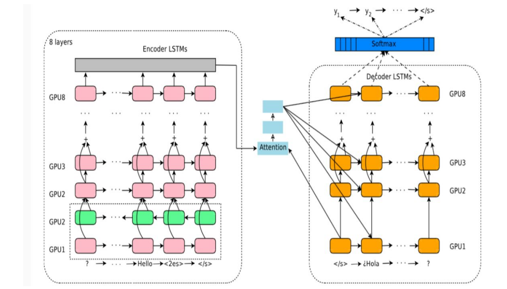
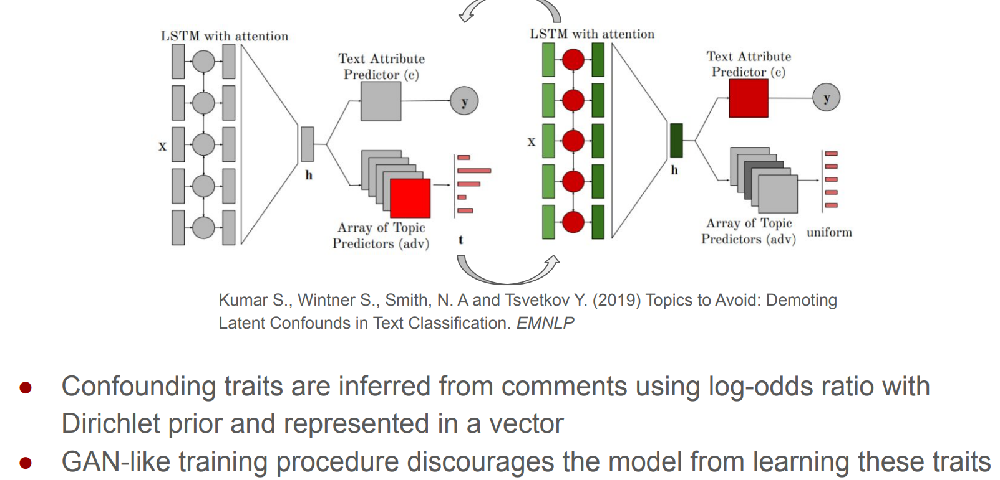
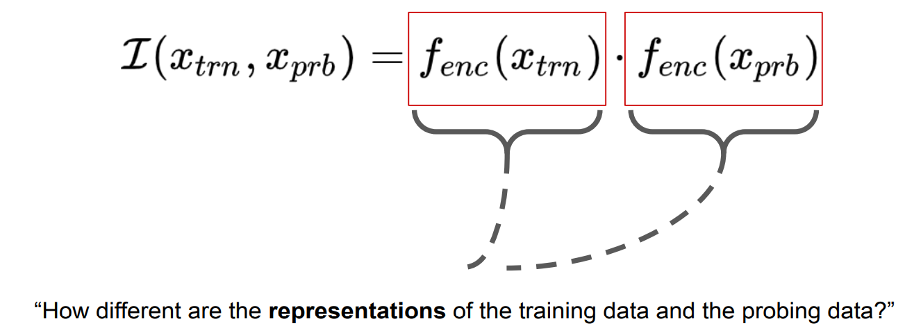
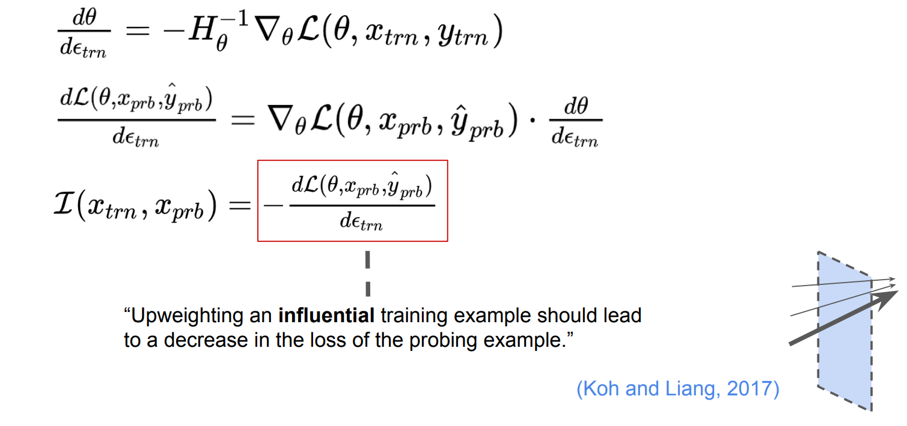
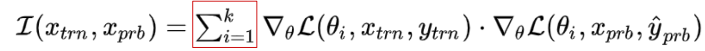

# Social & Ethical Considerations in NLP Systems

### Learn to assess AI systems adversarially

- **Ethics** of the research question 
- **Impact of technology and potential dual use**: Who could benefit from such a  technology? Who can be harmed by such a technology? Could sharing data  and models have major effect on people’s lives? 
- **Privacy**: Who owns the data? Published vs. publicized? User consent and  implicit assumptions of users how the data will be used.  
- **Bias in data**: Artifacts in data, population-specific distributions,  representativeness of data.  
- **Bias in models**: How to control for confounding variables and corner cases?  Does the system optimize for the “right” objective? Does the system amplify  bias? 
- **Utility-based evaluation beyond accuracy**: FP & FN rates, “the cost” of  misclassification, fault tolerance.

### Topics in the intersection of Ethics & NLP

- Algorithmic bias: social bias in data & NLP models
- Incivility: Hate-speech, toxicity, incivility, microaggressions online 
- Privacy violation: Privacy violation & language-based profiling
- Misinformation: Fake news, information manipulation, opinion manipulation 
- Technological divide: Unfair NLP technologies, underperforming for speakers  of minority dialects, for languages from developing countries, and for  disadvantaged populations

### Common biases that affect how we make decisions

- confirmation bias: paying more attention to information that reinforces  previously held beliefs and ignoring evidence to the contrary 
- ingroup favoritism: when one favors in-group members over out-group  members  
- group attribution error: when one generalizes about a group based on a group  of representatives 
- halo effect: when overall impression of a person impacts evaluation of their  specific traits
- just-world hypothesis: when one protects a desire for a just world by blaming  the victims
- etc.

### Social stereotypes

- Gender 
- Race 
- Disability 
- Age 
- Sexual orientation 
- Culture 
- Class 
- Poverty 
- Language 
- Religion 
- National origin

### Bias in data

Bias in language  

- Stereotypes, prejudices, toxic comments and other expressions of social biases 
- Historical human biases 
- Human reporting bias: topics, word frequencies are not a reflection of real world  

Bias in datasets  

- Data selection/sampling bias 
- Annotator selection bias  
- Annotators’ cognitive biases

### Natural Language Processing

### Example of bias mitigation (similar to multilingual  NMT)

### Towards a proactive approach

- Data: Automatic moderation, unveiling social biases and veiled toxicity in  training data, beyond overtly hateful speech 
- Socio-cultural knowledge representation: Learning to represent and analyze  how socio-cultural knowledge manifests in language 
- Modeling: New modeling approaches that incorporate socio-cultural context  and are trained to explicitly demote social biases  
- Evaluation and analysis: Developing interpretable models, or approaches to  interpreting existing models, and new approaches to evaluation and  characterization of model behaviors 

### Adversarial training to demote latent confounding  variables

### Embedding Similarity

### Influence Functions

### Gradient product

### In sum

- Biases in the data are pervasive and pernicious 
- SOTA NLP tools cannot identify toxic comments beyond overt hate speech  
  - Biases are subtle and implicit even experts are bad at identifying them 
  - We don’t have strong lexical sieve to surface candidates for annotation 
- Why is it important to detect biases in data:  
  - Posters are often unaware that their comments contains bias -- if they were, they may choose  not to post them  
  - Users can choose not to read flagged comments  
  - These comments can be filtered from the training data of AI systems 
- Direct supervised approaches are not enough we need paradigms shift in  modeling 

### Social and ethical challenges for language  technologies

- Incivility: Hate-speech, toxicity, incivility, microaggressions online  
- Social bias: Social bias in data & NLP models  
- Privacy violation: Privacy violation & language-based profiling 
- Misinformation: Fake news, Information manipulation, opinion manipulation 
- Technological divide: Unfair NLP technologies, underperforming for speakers  of minority dialects, for languages from developing countries, and for  disadvantaged populations

## Links

- [Yulia Tsvetkov](http://www.cs.cmu.edu/~ytsvetko/)

