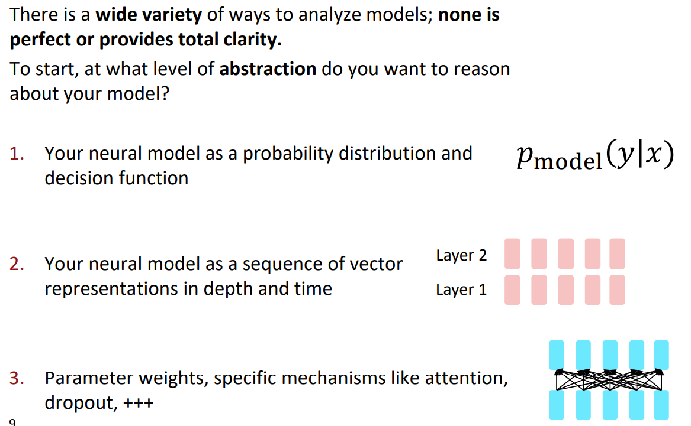
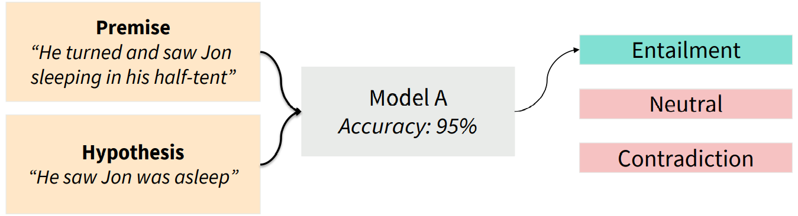
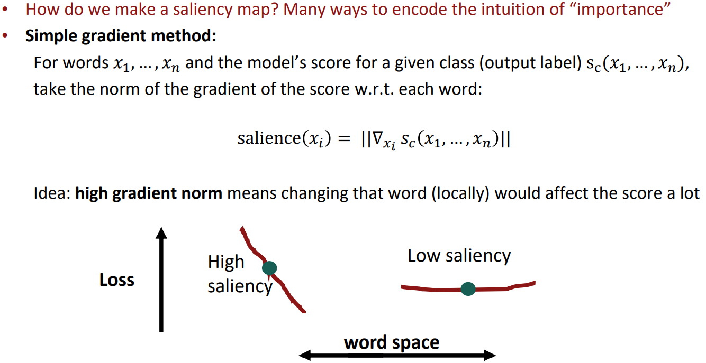
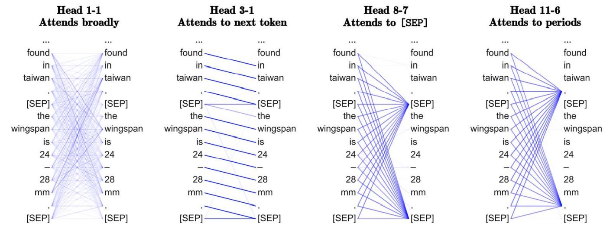
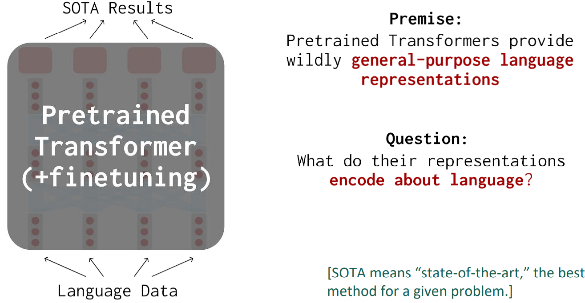
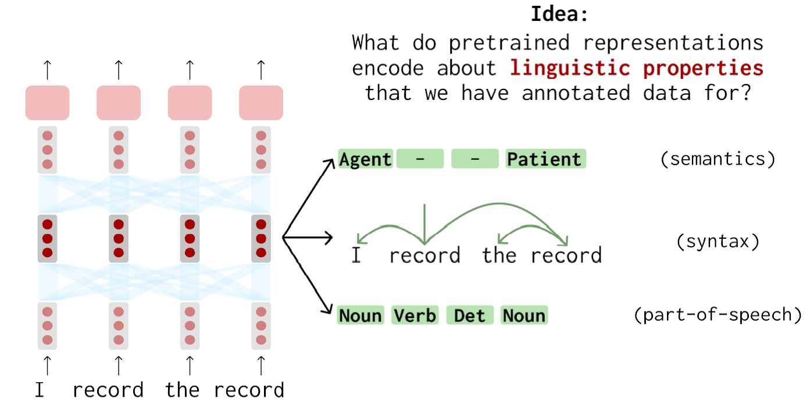
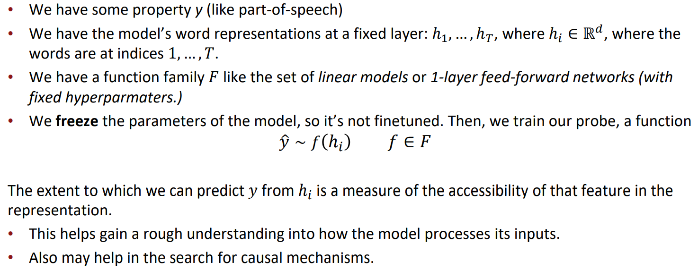
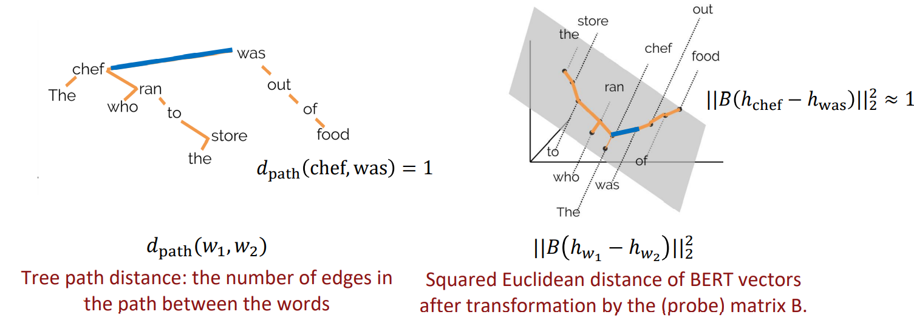
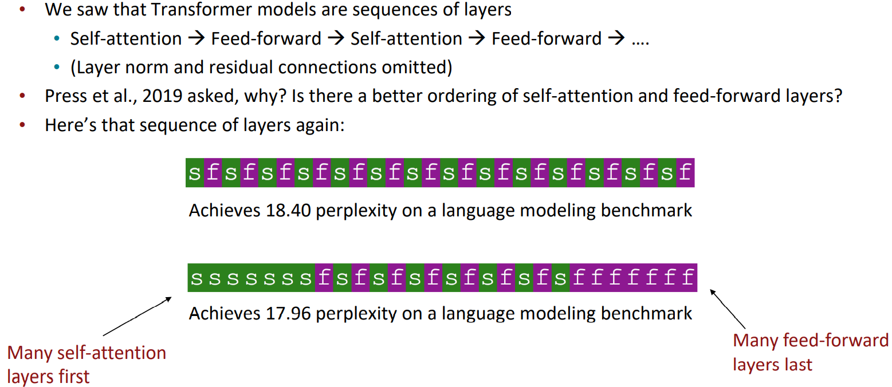

# Model Analysis and Explanation

## Model analysis at varying levels of abstraction

## Out-of-domain evaluation sets

### Model evaluation as model analysis

When looking at the behavior of a model, we’re not yet concerned with mechanisms the model is using. We want to ask how does model behave in situations of interest? 

- You’ve trained your model on some samples （𝑥, 𝑦） ~ 𝐷 from some distribution. 
- How does the model behave on samples from the same distribution? 
  - Aka in-domain or i.i.d. (independently and identically distributed) 
  - This is your test set accuracy / F1 / BLEU

## Knowledge evaluation as model analysis

- What has a language model learned from pretraining? 
- Last week, we saw one way of accessing some of the knowledge in the model by providing it with  prompts. 
- This fits into the set of behavioral studies we’ve seen so far!

## Influence studies and adversarial examples

### Prediction explanations: simple saliency maps

## Analyzing representations

### Analysis of “interpretable” architecture components

**Idea: Some modeling components lend themselves to inspection.** 

For example, can we try to characterize each attention head of BERT?

**Idea: Individual hidden units can lend themselves to an interpretable meaning.** 

This model: a character-level LSTM language model

### Probing: supervised analysis of neural networks

### Probing: trees simply recoverable from BERT representations

- Recall dependency parse trees. They describe underlying syntactic structure in sentences. 
- Hewitt and Manning 2019 show that BERT models make dependency parse tree structure easily  accessible.

### Final thoughts on probing and correlation studies

- Probing shows that properties are accessible to your probe family, not that they’re used by the  neural model you’re studying. 
- Correlation studies (like attention maps) likewise. 
- For example: 
  - Hewitt and Liang, 2019 show that under certain conditions, probes can achieve high accuracy on  random labels. 
  - Ravichander et al., 2021 show that probes can achieve high accuracy on a property even when  the model is trained to know the property isn’t useful. 
- Some efforts (Vig et al., 2020) have gone towards causal studies. Interesting and harder!

## Revisiting model ablations as analysis

- Consider the usual neural network improvement process: 
  - You have a network, which works okay. 
  - You see whether you can tweak it in simple ways to improve it. 
  - You see whether you can remove any complex things and have it still work as well. 
- This can be thought of as a kind of model analysis!

### What’s the right layer order for a Transformer?

### Parting thoughts

- Neural models are complex, and difficult to characterize. A single accuracy metric  doesn’t cut it. 
- We struggle to find intuitive descriptions of model behaviors, but we have a many tools  at many levels of abstraction to give insight. 
- Engage critically when someone claims a (neural) NLP model is interpretable – in what  ways is it interpretable? In what ways is it still opaque? 
- Bring this analysis and explanation way of thinking with you to your model building  efforts even if analysis isn’t your main goal.

## Links

- [John Hewitt](https://nlp.stanford.edu/~johnhew/)

