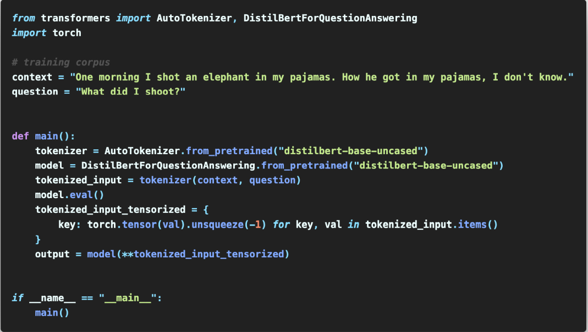

# Future of NLP + Deep Learning

## Extremely large models and GPT3 

175 BILLION parameters (nlayers = 96, nheads = 96, dheads = 128)

Same architecture as GPT-2 with the exception of locally banded sparse attention patterns

GPT-3 is currently released only via an inference API. Since it’s  release, there have been many interesting applications that  demonstrate its flexible few-shot learning abilities

### GPT-3: Limitations and Open questions

- Seems to do poorly on more structured problems that involve decomposing into  atomic / primitive skills: 
  - RTE / arithmetic / word problems / analogy making 
- Performing permanent knowledge updates interactively is not well studied.  
- Doesn’t seem to exhibit human like generalization (systematicity). 
- Language is situated and GPT-3 is merely learning from text without being  exposed to other modalities.

## Compositional Representations and Systematic Generalization

Systematicity: The ability to produce/understand some sentences is intrinsically connected  to the ability to produce / understand certain others. This means there is a “definite and  predictable pattern among the sentences we understand”

### Are human languages compositional?

### How do we measure if representations from a  certain neural network exhibit compositionality?

### Do neural networks generalize systematically?

## Improving how we evaluate models in NLP 

- Instead of testing models on static benchmarks, evaluate on an ever  changing dynamic benchmark. 
- Recent Examples:  
  - Adversarial NLI by Nie et al. 2020 
  - DynaSent by Potts et al. 2020  
  - other related examples: “Build It, Break It” Workshop at EMNLP 17

## Grounding language to other modalities

- Many have articulated the need for using modalities other than text 
- Bender and Koller [2020]: Impossible to acquire “meaning” (communicative  intent of the speaker) from form (text / speech signal) alone 
- Bisk et al [2020]: Training on only web-scale data limits the world scope of  models.

Open questions in this space:  

1. Given that we might need to move beyond just text, what is the best way to do this at scale?  
2. Babies cannot learn language from watching TV alone [Snow et al 1976] but how far can models  (especially when combined with scale)? 
3. If interactions with the environment is necessary, how do we collect data and design systems that  interact minimally or in a cost effective way? 
4. Could pre-training on text still be useful by making any of the above more sample-efficient?

## Getting involved with NLP ∩ Deep Learning Research!

Master your software tools: 

1. Scripting tools: awk, grep, bash 
2. version control: git 
3. data wrangling: pandas 
4. Jupyter notebooks for quick visualizations 
5. experiment management tools like Weights and Biases (https://wandb.ai/site)

Tips：

- If your approach doesn’t seem to be working: Don’t panic! 
- Put assert statements everywhere to check if computations are correct. 
- Use breakpoints (import pdb; pdb.set_trace();) extensively  
- Check if the loss computation is correct: For a k-way classification problem, initial loss should be ln(k) 
- Start by creating a small training dataset (10 examples) and see if your model can overfit to this. 
- check for saturating activations, dead ReLUs  
- Check if gradient values are too small (perhaps use residual connections / LSTMs instead of RNNs/ better initialization) or too large (use gradient clipping) 
- Overall, be methodical. If your approach doesn’t work, come up with hypothesis for why this might be  the case, and design oracle experiments to debug it!
- Like gdb, but for python 
- To create a breakpoint, simple add the line import pdb; pdb.set_trace() before the line you want to  inspect.

### Concluding Thoughts

Serious progress in the last decade thanks to data + hardware + neural networks. 

We now have amazing technologies such as GPT-3 that can do truly exciting things. 

In the short term: 

- Scaling helps, so perhaps even larger models? 
- Scaling requires very non-trivial engineering efforts so a lot of interesting systems 
- work to be done here! 

In the long term: 

- Making progress towards systematicity, fast adaptation, generalization 
- Improved evaluation so we can trust benchmarks 
- Figuring out how to move beyond text in a tractable way

## Links

- [Shikhar Murty](https://murtyshikhar.github.io/)

