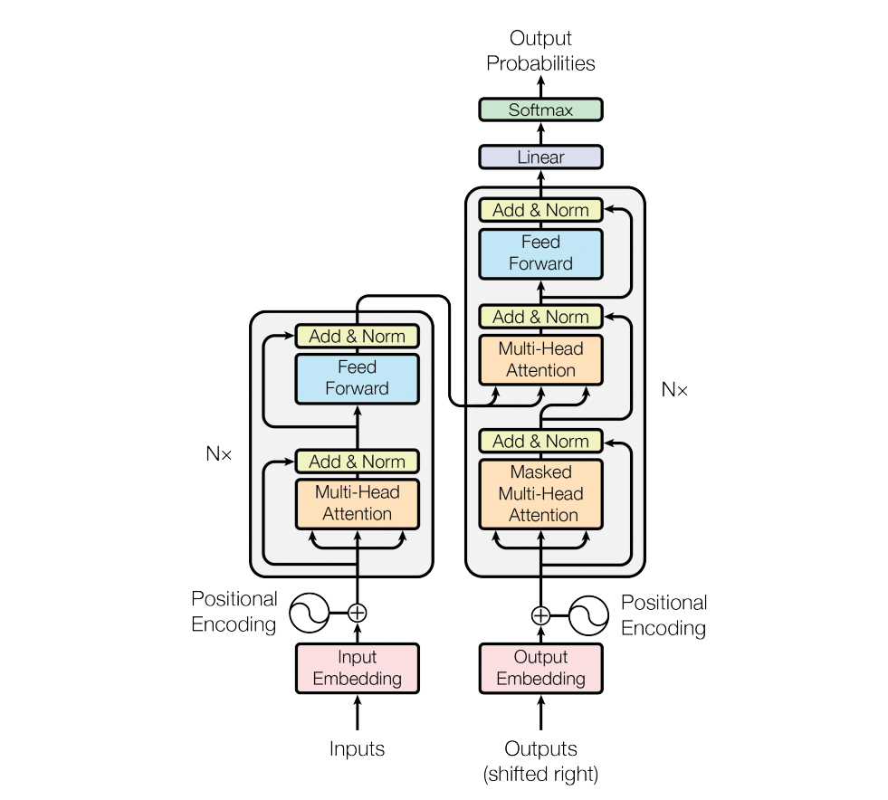

# Transformer

## 0. 架构图



## **1. 数据准备**

```python
import torch
import numpy as np
import torch.nn as nn
import torch.optim as optim
import torch.utils.data as Data

            # Encoder_input    Decoder_input        Decoder_output
sentences = [['我 是 学 生 P', 'S I am a student', 'I am a student E'],  # S: 开始符号
             ['我 喜 欢 学 习', 'S I like learning P', 'I like learning P E'],  # E: 结束符号
             ['我 是 男 生 P', 'S I am a boy', 'I am a boy E']]  # P: 占位符号，如果当前句子不足固定长度用P占位

src_vocab = {'P': 0, '我': 1, '是': 2, '学': 3, '生': 4, '喜': 5, '欢': 6, '习': 7, '男': 8}  # 词源字典  字：索引
src_idx2word = {src_vocab[key]: key for key in src_vocab}
src_vocab_size = len(src_vocab)  # 字典字的个数
tgt_vocab = {'S': 0, 'E': 1, 'P': 2, 'I': 3, 'am': 4, 'a': 5, 'student': 6, 'like': 7, 'learning': 8, 'boy': 9}
idx2word = {tgt_vocab[key]: key for key in tgt_vocab}  # 把目标字典转换成 索引：字的形式
tgt_vocab_size = len(tgt_vocab)  # 目标字典尺寸
src_len = len(sentences[0][0].split(" "))  # Encoder输入的最大长度
tgt_len = len(sentences[0][1].split(" "))  # Decoder输入输出最大长度


# 把sentences 转换成字典索引
def make_data(sentences):
    enc_inputs, dec_inputs, dec_outputs = [], [], []
    for i in range(len(sentences)):
        enc_input = [[src_vocab[n] for n in sentences[i][0].split()]]
        dec_input = [[tgt_vocab[n] for n in sentences[i][1].split()]]
        dec_output = [[tgt_vocab[n] for n in sentences[i][2].split()]]
        enc_inputs.extend(enc_input)
        dec_inputs.extend(dec_input)
        dec_outputs.extend(dec_output)
    return torch.LongTensor(enc_inputs), torch.LongTensor(dec_inputs), torch.LongTensor(dec_outputs)

enc_inputs, dec_inputs, dec_outputs = make_data(sentences)

# print(enc_inputs, enc_inputs.shape)

# 自定义数据集函数
class MyDataSet(Data.Dataset):
    def __init__(self, enc_inputs, dec_inputs, dec_outputs):
        super(MyDataSet, self).__init__()
        self.enc_inputs = enc_inputs
        self.dec_inputs = dec_inputs
        self.dec_outputs = dec_outputs

    def __len__(self):
        return self.enc_inputs.shape[0]

    def __getitem__(self, idx):
        return self.enc_inputs[idx], self.dec_inputs[idx], self.dec_outputs[idx]


loader = Data.DataLoader(MyDataSet(enc_inputs, dec_inputs, dec_outputs), 2, True)

# 参数设置
d_model = 512   # 字 Embedding 的维度
d_ff = 2048     # 前向传播隐藏层维度 d_ff = d_model * 4
d_k = d_v = 64  # K(=Q), V的维度
n_layers = 6    # 有多少个encoder和decoder
n_heads = 8     # Multi-Head Attention设置为8  d_k * n_heads = d_model
```

sentences 里一共有三个训练数据，中文->英文。把Encoder_input、Decoder_input、Decoder_output转换成字典索引，例如"学"->3、"student"->6。再把数据转换成batch大小为2的分组数据，3句话一共可以分成两组，一组2句话、一组1句话。src_len表示中文句子固定最大长度，tgt_len 表示英文句子固定最大长度。

## 2. 定义位置信息

```python
# Positional Embedding
class PositionalEncoding(nn.Module):
    def __init__(self, d_model, dropout=0.1, max_len=5000):
        super(PositionalEncoding, self).__init__()
        self.dropout = nn.Dropout(p=dropout)
        # pos_table 第一个维度对应第几个词 pos，第二个维度对应每个词的词嵌入维度 i，[max_len, d_model]
        pos_table = np.array([
        [pos / np.power(10000, 2 * i / d_model) for i in range(d_model)]    # i 针对词嵌入的维度
        if pos != 0 else np.zeros(d_model) for pos in range(max_len)])      # pos 针对第几个词
        pos_table[1:, 0::2] = np.sin(pos_table[1:, 0::2])                   # 字嵌入维度为偶数时
        pos_table[1:, 1::2] = np.cos(pos_table[1:, 1::2])                   # 字嵌入维度为奇数时
        self.pos_table = torch.FloatTensor(pos_table).cuda()                # enc_inputs: [seq_len, d_model]

    def forward(self, enc_inputs):                                          # enc_inputs: [batch_size, seq_len, d_model]
        enc_inputs += self.pos_table[:enc_inputs.size(1), :]                # 注意，tensor的size(n)表示第n的维度大小，与numpy的array.size不一样，np只是个数值
        return self.dropout(enc_inputs.cuda())
```

生成位置信息矩阵pos_table，直接加上输入的enc_inputs上，得到带有位置信息的字向量，pos_table是一个固定值的矩阵。这里矩阵加法利用到了广播机制.

## **3. Mask掉停用词**

```python
# Mask掉停用词
def get_attn_pad_mask(seq_q, seq_k):                       # seq_q: [batch_size, seq_len] ,seq_k: [batch_size, seq_len]
    batch_size, len_q = seq_q.size()
    batch_size, len_k = seq_k.size()
    pad_attn_mask = seq_k.data.eq(0).unsqueeze(1)          # 判断 输入那些含有P(=0),用1标记 ,[batch_size, 1, len_k]
    return pad_attn_mask.expand(batch_size, len_q, len_k)  # 扩展成多维度, [batch_size, len_q, len_k]


# Decoder 输入 Mask
def get_attn_subsequence_mask(seq):                               # seq: [batch_size, tgt_len]
    attn_shape = [seq.size(0), seq.size(1), seq.size(1)]
    subsequence_mask = np.triu(np.ones(attn_shape), k=1)          # 生成上三角矩阵,[batch_size, tgt_len, tgt_len], 数值为1
    subsequence_mask = torch.from_numpy(subsequence_mask).byte()  #  [batch_size, tgt_len, tgt_len]
    return subsequence_mask
```

- Mask句子中没有实际意义的占位符，例如'我 是 学 生 P' ，P对应句子没有实际意义，所以需要被Mask，Encoder_input 和Decoder_input占位符都需要被Mask。

- 用来Mask未来输入信息，返回的是一个上三角矩阵。比如我们在中英文翻译时候，会先把"我是学生"整个句子输入到Encoder中，得到最后一层的输出后，才会在Decoder输入**"S I am a student"**（s表示开始）,但是**"S I am a student"**这个句子我们不会一起输入，而是在**T0**时刻先输入**"S"**预测，预测第一个词**"I"；**在下一个**T1**时刻，同时输入**"S"**和**"I"**到Decoder预测下一个单词**"am"；**然后在**T2**时刻把**"S,I,am"**同时输入到Decoder预测下一个单词**"a"**，依次把整个句子输入到Decoder,预测出**"I am a student E"。**

## **4. 计算注意力信息、残差和归一化、前馈神经网络**

```python
# 计算注意力信息、残差和归一化
class ScaledDotProductAttention(nn.Module):
    def __init__(self):
        super(ScaledDotProductAttention, self).__init__()

    def forward(self, Q, K, V, attn_mask):
        # Q: [batch_size, n_heads, len_q, d_k]
        # K: [batch_size, n_heads, len_k, d_k]
        # V: [batch_size, n_heads, len_v(=len_k), d_v]
        # attn_mask: [batch_size, n_heads, seq_len, seq_len]
        scores = torch.matmul(Q, K.transpose(-1, -2)) / np.sqrt(d_k)  # scores : [batch_size, n_heads, len_q, len_k]
        scores.masked_fill_(attn_mask, -1e9)  # 如果时停用词P就等于 0
        attn = nn.Softmax(dim=-1)(scores)
        context = torch.matmul(attn, V)  # [batch_size, n_heads, len_q, d_v]
        return context, attn


class MultiHeadAttention(nn.Module):
    def __init__(self):
        super(MultiHeadAttention, self).__init__()
        self.W_Q = nn.Linear(d_model, d_k * n_heads, bias=False)
        self.W_K = nn.Linear(d_model, d_k * n_heads, bias=False)
        self.W_V = nn.Linear(d_model, d_v * n_heads, bias=False)
        self.fc = nn.Linear(n_heads * d_v, d_model, bias=False)     # multi-head 最后concat后需要乘上一个W_O得到一个 总输出b

    def forward(self, input_Q, input_K, input_V, attn_mask):
        # input_Q: [batch_size, len_q, d_model]
        # input_K: [batch_size, len_k, d_model]
        # input_V: [batch_size, len_v(=len_k), d_model]
        # attn_mask: [batch_size, seq_len, seq_len]
        residual, batch_size = input_Q, input_Q.size(0)
        # view()函数相当于reshape函数
        Q = self.W_Q(input_Q).view(batch_size, -1, n_heads, d_k).transpose(1, 2)  # Q: [batch_size, n_heads, len_q, d_k]
        K = self.W_K(input_K).view(batch_size, -1, n_heads, d_k).transpose(1, 2)  # K: [batch_size, n_heads, len_k, d_k]
        V = self.W_V(input_V).view(batch_size, -1, n_heads, d_v).transpose(1, 2)  # V: [batch_size, n_heads, len_v(=len_k), d_v]
        attn_mask = attn_mask.unsqueeze(1).repeat(1, n_heads, 1, 1)  # attn_mask : [batch_size, n_heads, seq_len, seq_len]
        context, attn = ScaledDotProductAttention()(Q, K, V, attn_mask)  # context: [batch_size, n_heads, len_q, d_v]
        # attn: [batch_size, n_heads, len_q, len_k]
        context = context.transpose(1, 2).reshape(batch_size, -1,
                                                  n_heads * d_v)  # context: [batch_size, len_q, n_heads * d_v]
        output = self.fc(context)  # [batch_size, len_q, d_model]
        return nn.LayerNorm(d_model).cuda()(output + residual), attn    # ADD And Layer Norm

# 前馈神经网络
class PoswiseFeedForwardNet(nn.Module):
    def __init__(self):
        super(PoswiseFeedForwardNet, self).__init__()
        self.fc = nn.Sequential(
            nn.Linear(d_model, d_ff, bias=False),
            nn.ReLU(),
            nn.Linear(d_ff, d_model, bias=False))

    def forward(self, inputs):  # inputs: [batch_size, seq_len, d_model]
        residual = inputs
        output = self.fc(inputs)
        return nn.LayerNorm(d_model).cuda()(output + residual)  # [batch_size, seq_len, d_model]
```

- 计算注意力信息，W_Q, W_K, W_V矩阵拆分成8个小矩阵。注意传入的input_Q, input_K, input_V，在Encoder和Decoder的第一次调用传入的三个矩阵是相同的，但Decoder的第二次调用传入的三个矩阵input_Q **等于** input_K **不等于** input_V。

- 输入inputs ，经过两个全连接成，得到的结果再加上 inputs ，再做LayerNorm归一化。LayerNorm归一化可以理解层是把Batch中每一句话进行归一化。

## **5. Encoder**

```python
# 单个Encoder
class EncoderLayer(nn.Module):
    def __init__(self):
        super(EncoderLayer, self).__init__()
        self.enc_self_attn = MultiHeadAttention()                                     # 多头注意力机制
        self.pos_ffn = PoswiseFeedForwardNet()                                        # 前馈神经网络

    def forward(self, enc_inputs, enc_self_attn_mask):                                # enc_inputs: [batch_size, src_len, d_model]
        # 输入3个enc_inputs分别与W_q、W_k、W_v相乘得到Q、K、V                          # enc_self_attn_mask: [batch_size, src_len, src_len]
        enc_outputs, attn = self.enc_self_attn(enc_inputs, enc_inputs, enc_inputs,    # enc_outputs: [batch_size, src_len, d_model],
                                               enc_self_attn_mask)                    # attn: [batch_size, n_heads, src_len, src_len]
        enc_outputs = self.pos_ffn(enc_outputs)                                       # enc_outputs: [batch_size, src_len, d_model]
        return enc_outputs, attn

# 整个Encoder
class Encoder(nn.Module):
    def __init__(self):
        super(Encoder, self).__init__()
        self.src_emb = nn.Embedding(src_vocab_size, d_model)                     # 把字转换字向量
        self.pos_emb = PositionalEncoding(d_model)                               # 加入位置信息
        self.layers = nn.ModuleList([EncoderLayer() for _ in range(n_layers)])

    def forward(self, enc_inputs):                                               # enc_inputs: [batch_size, src_len]
        enc_outputs = self.src_emb(enc_inputs)                                   # enc_outputs: [batch_size, src_len, d_model]
        ''' token embedding 与 positional embedding如何混合？ '''
        enc_outputs = self.pos_emb(enc_outputs)                                  # enc_outputs: [batch_size, src_len, d_model]
        enc_self_attn_mask = get_attn_pad_mask(enc_inputs, enc_inputs)           # enc_self_attn_mask: [batch_size, src_len, src_len]
        enc_self_attns = []
        for layer in self.layers:
            enc_outputs, enc_self_attn = layer(enc_outputs, enc_self_attn_mask)  # enc_outputs :   [batch_size, src_len, d_model],
                                                                                 # enc_self_attn : [batch_size, n_heads, src_len, src_len]
            enc_self_attns.append(enc_self_attn)
        return enc_outputs, enc_self_attns
```

- 第一步，中文字索引进行Embedding，转换成512维度的字向量。第二步，在子向量上面加上位置信息。第三步，Mask掉句子中的占位符号。第四步，通过6层的encoder（上一层的输出作为下一层的输入）。

## **6. Decoder**

```python
# 单个decoder
class DecoderLayer(nn.Module):
    def __init__(self):
        super(DecoderLayer, self).__init__()
        self.dec_self_attn = MultiHeadAttention()
        self.dec_enc_attn = MultiHeadAttention()
        self.pos_ffn = PoswiseFeedForwardNet()

    def forward(self, dec_inputs, enc_outputs, dec_self_attn_mask, dec_enc_attn_mask): # dec_inputs: [batch_size, tgt_len, d_model]
                                                                                       # enc_outputs: [batch_size, src_len, d_model]
                                                                                       # dec_self_attn_mask: [batch_size, tgt_len, tgt_len]
                                                                                       # dec_enc_attn_mask: [batch_size, tgt_len, src_len]
        dec_outputs, dec_self_attn = self.dec_self_attn(dec_inputs, dec_inputs,
                                                 dec_inputs, dec_self_attn_mask)   # dec_outputs: [batch_size, tgt_len, d_model]
                                                                                   # dec_self_attn: [batch_size, n_heads, tgt_len, tgt_len]
        dec_outputs, dec_enc_attn = self.dec_enc_attn(dec_outputs, enc_outputs,
                                                enc_outputs, dec_enc_attn_mask)    # dec_outputs: [batch_size, tgt_len, d_model]
                                                                                   # dec_enc_attn: [batch_size, h_heads, tgt_len, src_len]
        dec_outputs = self.pos_ffn(dec_outputs)                                    # dec_outputs: [batch_size, tgt_len, d_model]
        return dec_outputs, dec_self_attn, dec_enc_attn

# 整个Decoder
class Decoder(nn.Module):
    def __init__(self):
        super(Decoder, self).__init__()
        self.tgt_emb = nn.Embedding(tgt_vocab_size, d_model)
        self.pos_emb = PositionalEncoding(d_model)
        self.layers = nn.ModuleList([DecoderLayer() for _ in range(n_layers)])

    def forward(self, dec_inputs, enc_inputs, enc_outputs):                               # dec_inputs: [batch_size, tgt_len]
                                                                                          # enc_intpus: [batch_size, src_len]
                                                                                          # enc_outputs: [batsh_size, src_len, d_model]
        dec_outputs = self.tgt_emb(dec_inputs)                                            # [batch_size, tgt_len, d_model]
        dec_outputs = self.pos_emb(dec_outputs).cuda()                                    # [batch_size, tgt_len, d_model]
        dec_self_attn_pad_mask = get_attn_pad_mask(dec_inputs, dec_inputs).cuda()         # [batch_size, tgt_len, tgt_len]
        dec_self_attn_subsequence_mask = get_attn_subsequence_mask(dec_inputs).cuda()     # [batch_size, tgt_len, tgt_len]
        # gt(a, b) a>b , return true
        # >>> torch.gt(torch.tensor([[1, 2], [3, 4]]), torch.tensor([[1, 1], [4, 4]]))
        # tensor([[False, True], [False, False]])
        dec_self_attn_mask = torch.gt((dec_self_attn_pad_mask +
                                       dec_self_attn_subsequence_mask), 0).cuda()         # [batch_size, tgt_len, tgt_len]
        dec_enc_attn_mask = get_attn_pad_mask(dec_inputs, enc_inputs)                     # [batc_size, tgt_len, src_len]
        dec_self_attns, dec_enc_attns = [], []
        for layer in self.layers:                             # dec_outputs: [batch_size, tgt_len, d_model]
                                                              # dec_self_attn: [batch_size, n_heads, tgt_len, tgt_len]
                                                              # dec_enc_attn: [batch_size, h_heads, tgt_len, src_len]
            dec_outputs, dec_self_attn, dec_enc_attn = layer(dec_outputs, enc_outputs, dec_self_attn_mask, dec_enc_attn_mask)
            dec_self_attns.append(dec_self_attn)
            dec_enc_attns.append(dec_enc_attn)
        return dec_outputs, dec_self_attns, dec_enc_attns
```

- 第一步，英文字索引进行Embedding，转换成512维度的字向量。第二步，在子向量上面加上位置信息。第三步，Mask掉句子中的占位符号和输出顺序细节见步骤3。第四步，通过6层的decoder（上一层的输出作为下一层的输入）。

## 7. Transformer

```python
# Trasformer
class Transformer(nn.Module):
    def __init__(self):
        super(Transformer, self).__init__()
        self.Encoder = Encoder().cuda()
        self.Decoder = Decoder().cuda()
        self.projection = nn.Linear(d_model, tgt_vocab_size, bias=False).cuda()
    def forward(self, enc_inputs, dec_inputs):                         # enc_inputs: [batch_size, src_len]
                                                                       # dec_inputs: [batch_size, tgt_len]
        enc_outputs, enc_self_attns = self.Encoder(enc_inputs)         # enc_outputs: [batch_size, src_len, d_model],
                                                                       # enc_self_attns: [n_layers, batch_size, n_heads, src_len, src_len]
        dec_outputs, dec_self_attns, dec_enc_attns = self.Decoder(
            dec_inputs, enc_inputs, enc_outputs)                       # dec_outpus    : [batch_size, tgt_len, d_model],
                                                                       # dec_self_attns: [n_layers, batch_size, n_heads, tgt_len, tgt_len],
                                                                       # dec_enc_attn  : [n_layers, batch_size, tgt_len, src_len]
        dec_logits = self.projection(dec_outputs)                      # dec_logits: [batch_size, tgt_len, tgt_vocab_size]
        return dec_logits.view(-1, dec_logits.size(-1)), enc_self_attns, dec_self_attns, dec_enc_attns
```

- Trasformer的整体结构，输入数据先通过Encoder，再同个Decoder，最后把输出进行多分类，分类数为英文字典长度，也就是判断每一个字的概率。

## **8. 定义网络与训练测试**

```python
# 定义网络
model = Transformer().cuda()
criterion = nn.CrossEntropyLoss(ignore_index=0)     #忽略 占位符 索引为0.
optimizer = optim.SGD(model.parameters(), lr=1e-3, momentum=0.99)

# 训练Transformer
for epoch in range(50):
    for enc_inputs, dec_inputs, dec_outputs in loader:  # enc_inputs : [batch_size, src_len]
        # dec_inputs : [batch_size, tgt_len]
        # dec_outputs: [batch_size, tgt_len]

        enc_inputs, dec_inputs, dec_outputs = enc_inputs.cuda(), dec_inputs.cuda(), dec_outputs.cuda()
        outputs, enc_self_attns, dec_self_attns, dec_enc_attns = model(enc_inputs, dec_inputs)
        # outputs: [batch_size * tgt_len, tgt_vocab_size]
        loss = criterion(outputs, dec_outputs.view(-1))
        print('Epoch:', '%04d' % (epoch + 1), 'loss =', '{:.6f}'.format(loss))
        optimizer.zero_grad()
        loss.backward()
        optimizer.step()

# 测试模型
def test(model, enc_input, start_symbol):
    enc_outputs, enc_self_attns = model.Encoder(enc_input)
    dec_input = torch.zeros(1, tgt_len).type_as(enc_input.data)
    next_symbol = start_symbol
    for i in range(0, tgt_len):
        dec_input[0][i] = next_symbol
        dec_outputs, _, _ = model.Decoder(dec_input, enc_input, enc_outputs)
        projected = model.projection(dec_outputs)
        prob = projected.squeeze(0).max(dim=-1, keepdim=False)[1]
        next_word = prob.data[i]
        next_symbol = next_word.item()
    return dec_input

enc_inputs, _, _ = next(iter(loader))
predict_dec_input = test(model, enc_inputs[0].view(1, -1).cuda(), start_symbol=tgt_vocab["S"])
predict, _, _, _ = model(enc_inputs[0].view(1, -1).cuda(), predict_dec_input)
predict = predict.data.max(1, keepdim=True)[1]

print([src_idx2word[int(i)] for i in enc_inputs[0]], '->',
[idx2word[n.item()] for n in predict.squeeze()])
```

## 9. 一些细节

- positional embedding在Transformer和bert中方式不一样，positional embbeding的设计是一个课题

- 注意Multi-Head Self-Attention相比正常的Self-Attention只在最后concat的时候多出参数，同时在最后concat后需要经过一个Linear层

- Wq，Wk，Wv是要训练的参数，其尺寸取决于输入的embedding向量长度和句子长度

- **区分Layer Normalization与Batch Normalization**

  ```python
  a = [[[3, 4, 6], [4, 5, 6]],[[4, 4, 4], [4, 5, 6]], [[3, 4, 6], [4, 5, 6]], [[3, 4, 6], [4, 5, 6]]]
  
  e = torch.FloatTensor(a)
  print(e.size(0), e.size(1), e.size(2))
  
  f = torch.nn.LayerNorm(3)(e)
  m = torch.nn.BatchNorm1d(2, 3)
  g = m(e)
  ```

- Feed Forward是一个两层的线性层，使用Relu函数

- Encoder与Decoder连接的attention，Encoder提供k和v，Decoder提供q

- Decoder的Multi-Head Self-Attention带Mask，Mask在矩阵计算中相当于实现一个上三角矩阵，带Mask是为了并行训练计算，实际测试是依次一个个输入。

- Positional Embedding与Token Embedding相加的操作细节

- Multi-Head在切分的时候，其数量Head_Num是在Embedding向量维度上切分的

- 参数设置中需要满足的一些条件：d_k（一个head对应的计算矩阵维度） * n_heads（head数目） = d_model（embedding维度）；Relu层中的隐藏层神经元数目是embedding维度的4倍：d_ff = d_model * 4

**Test:**

- [Colab](https://colab.research.google.com/drive/1avycotLAFcgXUP1qTk0bSX_jVGhjtZaV?usp=sharing)